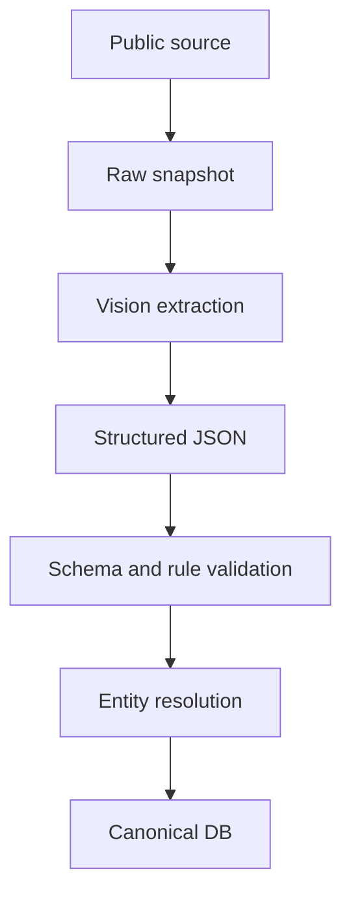
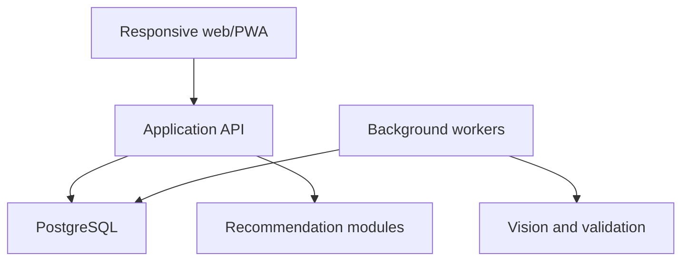

# Resonance — Data Pipeline & Architecture

> 상태: Data baseline + technical direction v1.0  
> 기준일: 2026-09-14

## 1. 핵심 원칙

- 사용자 요청 시 웹을 새로 긁어 추천하지 않는다.
- 수집·검증·정규화가 끝난 Canonical DB를 서비스의 source of truth로 사용한다.
- 원본과 정규화 결과, 출처, 처리 버전을 함께 보존한다.
- 즉시 응답 경로와 시간이 오래 걸리는 수집·Vision·검증 경로를 분리한다.
- 예매 플랫폼의 로그인·좌석 선택·주문·결제 영역을 자동 접근하지 않는다.

## 2. 공연 데이터 소스 전략

### 2.1 기본 구조 — 현재 데이터 방향

| 역할 | 소스 |
| --- | --- |
| 1차 구조화 소스 | KOPIS Open API |
| 빠른 발견 후보 | NOL 공개 오픈예정, 공식 티켓 오픈 공지, 공연장·연주자 공식 일정 |
| 상세 보강 | 공연 상세의 공개 이미지, 프로그램북, 공식 페이지 |

KOPIS는 구조화가 용이하지만 티켓 선점 관점의 지연이 있을 수 있다. 모든 공연에 조기 소스를 붙이지 않고, 지연이 좌석 기회에 실제 영향을 주는 공연군에서만 보강하는 방향이다.

### 2.2 검증할 가설

- KOPIS 등록·수정 시점이 공식 티켓 오픈 또는 NOL 오픈예정 대비 얼마나 늦는가?
- 그 지연이 원하는 좌석을 확보할 기회를 실질적으로 낮추는가?
- 추가 조기 소스의 유지보수 비용보다 효과가 큰가?

이 결과를 측정하기 전 “NOL이 항상 가장 빠르다” 또는 “KOPIS만으로 충분하다”고 확정하지 않는다.

## 3. 공개 페이지 접근 경계

NOL 등을 보조 소스로 확인할 경우:

- 공개 공연 메타데이터와 공개 상세 이미지만 다룬다.
- 로그인, 예매, 잔여 좌석, 좌석 선택, 주문, 결제 영역에 자동 접근하지 않는다.
- 낮은 빈도로 변경분만 확인한다.
- robots, 이용약관, 저작권 및 서비스 안정성을 준수한다.
- 오픈예정 목록이 모든 신규 공연을 포함한다고 가정하지 않는다.

## 4. 프로그램 상세 이미지 처리

### 4.1 기본 처리 — 현재 데이터 방향

낮은 월간 물량에서는 `Vision + Structured Output`을 기본선으로 둔다. OCR-first는 2단 편집, 작품–악장 관계, 읽기 순서가 손실될 수 있으므로 기본값으로 확정하지 않는다.



OCR은 정확도와 비용 비교를 위한 fallback 후보로 남긴다. 월 60장 수준이라는 기존 가정은 운영량 산정용이며 고정 요구사항이 아니다.

### 4.2 프로그램 구조

프로그램은 단순 문자열 배열이 아니라 계층 구조를 가진다.

- 공연 순서
- 작곡가
- 작품
- 악장
- 일부 악장만 연주되는 경우
- 휴식
- 협연자 또는 편성 연결

스키마가 안정되기 전에는 PostgreSQL의 관계형 필드와 JSONB를 함께 사용하는 방향이 적합하다.

### 4.3 검증

- JSON Schema 또는 Pydantic 검증
- 필수 필드와 형식 검사
- 공연 일시·순서·작품–악장 관계 규칙
- 원본 이미지와 추출 결과 대조
- Canonical entity resolver
- 확신도 또는 검토 필요 상태

Vision 또는 LLM 출력은 검증 없이 Canonical DB에 저장하지 않는다.

## 5. Canonical entity와 alias

다음 객체는 표기 변형을 흡수할 수 있는 Canonical ID와 alias를 가진다.

- 작곡가
- 작품과 악장
- 연주자·지휘자
- 악기·앙상블
- 공연장과 홀
- 공연

예:

```text
Canonical Artist: Astor Piazzolla
Aliases: 아스토르 피아졸라, A. Piazzolla, Ástor Piazzolla
```

### 보존 항목

- raw value
- normalized value
- source URL 또는 source ID
- 수집 시각
- extractor·validator 버전
- resolver 결과와 confidence
- 수동 수정 이력

규칙, fuzzy matching, LLM 중 어떤 resolver 조합을 쓸지는 alias 충돌률, unresolved rate, false merge, cache hit를 측정한 뒤 확정한다.

## 6. 변경 감지

- 전체 데이터를 매번 다시 처리하지 않는다.
- source ID, 수정일, 콘텐츠 hash 등으로 신규·변경 후보를 찾는다.
- 원본 snapshot을 남기고 변경된 데이터만 재검증한다.
- 공연 취소, 일시·출연자·프로그램 변경은 기존 공연 ID와 변경 이력을 유지한다.

## 7. 좌석 데이터 모델

### 7.1 기본 계층

```text
Venue
  └─ Hall
      └─ SeatMapVersion
          └─ Section
              └─ Row
                  └─ Seat
```

### 7.2 Seat 최소 필드 후보

```yaml
seat_id:
venue_id:
hall_id:
seat_map_version_id:
section:
row:
seat_number:
floor:
x_normalized:
y_normalized:
distance_from_stage:
distance_from_center:
```

정규화된 `x`, `y`가 있어야 같은 열의 좌우 위치, 중앙 이탈 정도, 무대 근접도를 일관되게 계산할 수 있다.

### 7.3 공연별 변형

기본 좌석도만으로 충분하지 않을 수 있다.

- 무대 확장으로 앞열 미판매
- 합창석 개방 여부
- 카메라·장비석
- 공연별 판매 제외 좌석
- 편성에 따른 무대 배치

따라서 `SeatMapVersion + EventSpecificConfiguration` 구조를 둔다.

### 7.4 초기 지원 공연장 — 후보, 미확정

전국 모든 홀을 지원하는 것은 MVP 범위를 벗어난다. 다음은 사용 사례가 이미 축적된 우선 후보일 뿐 최종 지원 목록은 아니다.

- 예술의전당 콘서트홀
- 세종문화회관 체임버홀
- 대전예술의전당 아트홀
- 군포문화예술회관 수리홀

## 8. 후기 근거 데이터

좌석 후기의 원문과 구조화 결과를 분리한다.

```text
Review Source
  ├─ raw text
  ├─ venue / hall / section / row / seat match
  ├─ aspect mentions
  ├─ sentiment or score
  ├─ concert context
  ├─ source and date
  └─ confidence / moderation state
```

실제 후기 기반 추천을 우선한다는 제품 방향은 확정되었지만, 외부 후기 소스의 사용 권한, 수집 방법, 인용·요약 정책, 작성자 신뢰도, 오래된 좌석 경험의 시간 감쇠는 아직 확정하지 않는다.

## 9. 애플리케이션 아키텍처 — 기술 방향

유지보수성을 위해 핵심 제품 로직과 배경 처리 로직을 분리한 `Modular Monolith + Worker` 방향을 사용한다.



### Application API 책임

- 인증·권한
- 공연·프로그램·아티클 조회
- Concert Taste와 Bookmarks
- 후기 CRUD
- 즉시 좌석 추천 요청
- 알림 deep link 대상 제공

### Background Worker 책임

- 외부 공개 소스의 저빈도 확인
- 변경 감지
- 이미지 수집과 Vision/OCR 후보 처리
- 구조 검증과 entity resolution
- 아티클 생성 보조
- 알림 생성 트리거

### n8n 경계

사용자의 최신 재설계 요구는 n8n이 없어도 운영 가능한 구조다. n8n을 핵심 백엔드, 인증, CRUD, 추천 API의 의존성으로 두지 않는다. 장기적으로 단순 운영 자동화에 선택적으로 사용할 수는 있지만 제품의 source of truth나 필수 런타임이 되어서는 안 된다.

## 10. 기술 스택 — 제안, 최종 확정 전

기존 논의에서 제시된 유지보수 중심 후보는 다음과 같다.

| 계층 | 후보 |
| --- | --- |
| Web/PWA | Next.js + TypeScript |
| API | FastAPI + Python |
| Database | Managed PostgreSQL/Supabase + JSONB |
| Vector search가 필요한 경우 | pgvector |
| Auth | Supabase Auth |
| Background jobs | Python worker + queue/scheduler |

이는 구현 제안이지 사용자 확정 스택은 아니다. 배포 플랫폼, queue, object storage, observability, CI/CD는 Open Question이다.

## 11. 데이터 경계와 개인정보

- 사용자별 Concert Taste, 북마크, 후기, 추천·행동 로그는 계정별로 격리한다.
- 외부 서비스 토큰이 있다면 최소 범위 권한과 안전한 서버 저장을 사용한다.
- 추천 개선용 행동 로그는 목적과 보존 기간을 명시해야 한다.
- 개인 후기의 공개·공유는 사용자가 명시적으로 선택하기 전 기본 비공개다.

