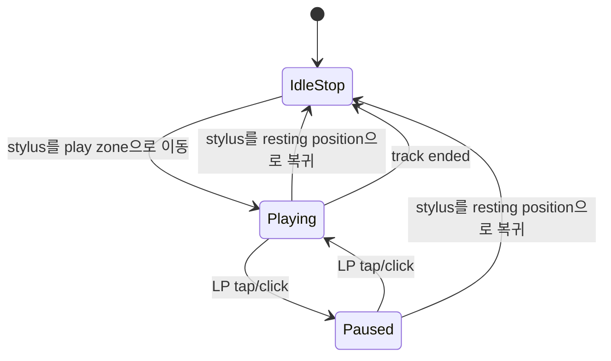

# Resonance — Interaction Specification

> 상태: Confirmed interaction model + unresolved accessibility details v1.0
> 기준일: 2026-09-15

## 1. 입력 원칙

- Mobile/Tablet은 tap, touch-drag와 콘텐츠 swipe를 사용할 수 있다.
- Desktop은 click, mouse/trackpad drag와 직접 navigation 선택을 사용한다.
- swipe나 drag만 유일한 이동 수단으로 두지 않고 직접 선택 가능한 control을 함께 유지한다.
- 화면 전환 중에도 사용자가 선택한 메뉴·공연·추천안·작성 중 상태를 잃지 않는다.

## 2. App Home과 primary content 전환

### App Home에서 destination으로

1. 사용자가 bottom navigation의 `For You`, `Articles`, `Reviews` 중 하나를 선택한다.
2. Home 콘텐츠와 navigation이 위로 끌어올려지는 vertical transition을 시작한다.
3. 같은 navigation이 content screen의 sticky top navigation이 된다.
4. 선택한 destination만 active 상태가 된다.

### Primary content에서 App Home으로

1. 사용자가 `resonance.` logo 등 Home 이동 control을 선택한다.
2. content와 top navigation이 아래로 이동한다.
3. navigation이 App Home의 bottom position으로 돌아간다.
4. LP와 stylus가 다시 나타나며 primary menu는 모두 비선택이 된다.

Desktop에서는 left sidebar를 사용하고 이 vertical navigation 이동을 복제하지 않는다. 위치·breakpoint는 [Responsive](RESPONSIVE.md)를 따른다.

## 3. Primary menu 간 이동

순서는 `For You ↔ Articles ↔ Reviews`다.

- top navigation의 메뉴를 직접 tap/click하면 slide animation 없이 즉시 해당 화면으로 전환한다.
- 콘텐츠 영역을 좌우 swipe하면 인접 destination으로 이동한다.
- swipe 중 콘텐츠는 gesture를 따라 좌우로 움직이며 완료 또는 취소 상태를 명확히 한다.
- Desktop에서 swipe를 강제하지 않는다.
- 끝 메뉴에서 범위 밖 destination을 생성하지 않는다.

gesture threshold, velocity와 취소 animation의 정확한 값은 Open Question이다.

## 4. Logo와 detail navigation

- `resonance.` logo는 App Home으로 이동한다.
- Review 작성 등 unsaved changes 보호가 필요한 화면에서는 보호 정책을 먼저 적용한다.
- `Concert Detail`, `Article Detail`, `Review Detail`은 global top navigation을 중첩하지 않고 compact header와 Back을 사용한다.
- Back은 논리적 parent primary context로 돌아가며 이전 list/feed scroll position과 가능한 UI state를 복원한다.
- 예: `For You → Concert Detail → Back`은 이전 For You 위치로 돌아간다.

복원 불가능한 state의 안전한 fallback과 unsaved changes 보호 수단의 상세는 제품 Open Question으로 유지한다.

## 5. LP playback state machine

App Home의 LP는 시각 prototype이 아니라 실제 playback UI다.

### Play

- Mobile/Tablet: stylus를 touch-drag로 LP의 play zone에 옮긴다.
- Desktop: mouse/trackpad drag로 옮긴다.
- LP가 회전하고 음원이 재생되며 중앙에 portrait가 나타난다.

### Pause / Resume

- Playing에서 LP를 tap/click하면 Paused가 된다.
- stylus 위치, portrait와 playback position은 유지하고 LP 회전만 멈춘다.
- 다시 LP를 tap/click하면 같은 위치에서 Resume한다.

### Stop

- stylus를 resting position으로 돌리면 Stop한다.
- playback position을 0으로 초기화하고 LP 회전을 멈춘다.
- portrait를 제거하고 노란 `resonance` label로 돌아간다.

### Track ended

- 곡이 끝나면 자동으로 Stop한다.
- stylus가 resting position으로 돌아간다.
- playback position을 초기화하고 노란 label을 복원한다.

음원은 Apple Music / Apple Music Classical 계열만 사용한다. MusicKit 권한·catalog mapping과 오류 처리는 engineering 검증 대상이며 상태 모델 자체를 다시 미확정으로 돌리지 않는다.

## 6. Common interaction states

| 상태 | 요구 |
| --- | --- |
| Loading | 진행 중인 대상과 완료 후 맥락을 알리고 중복 실행을 제어한다. |
| Empty | 비어 있는 이유를 구분하고 가능한 다음 행동을 제공한다. |
| Error | 입력과 현재 맥락을 보존하며 재시도 또는 안전한 복귀를 제공한다. |
| Partial data | 확인된 정보와 없는 정보를 구분한다. |
| Unsaved changes | 이탈 전에 입력 손실 보호 정책을 적용한다. 구현 수단은 미확정이다. |
| External transition | 예매처·원문 등 앱 밖 이동을 알린다. |
| Unsupported | 미지원 좌석도·기능의 범위와 대체 행동을 제공한다. |
| Focus | 현재 keyboard focus를 시각적으로 구분하고 active·selected와 혼동하지 않는다. |

LP의 재생 권한 거절, 네트워크 오류, unavailable track은 입력 맥락을 잃지 않는 오류 상태가 필요하다. 정확한 자동 재시도와 fallback은 MusicKit 검증 뒤 결정한다.

## 7. 접근성 interaction

현재 확정된 최소 범위:

- primary navigation과 logo·Back은 의미가 드러나는 직접 선택 control로 제공한다.
- swipe는 편의 gesture이며 같은 destination을 직접 선택할 수 있어야 한다.
- focus, active, selected, loading과 error를 색이나 motion 하나로만 전달하지 않는다.
- 상태 변화 중 입력과 focus를 예고 없이 잃지 않는다.

아직 결정할 항목:

- stylus drag를 대신하는 keyboard·switch·screen-reader control과 상태 announcement
- LP의 Play/Pause/Resume/Stop accessible name과 shortcut
- Seat map 확대·이동·추천 좌석 탐색의 keyboard 순서와 screen-reader 요약
- Review rating component의 keyboard 조작과 값 읽기
- swipe·vertical transition의 reduced motion 동작과 timing

## 8. Open Questions

- navigation transition duration, easing과 gesture 취소 기준
- LP permission 요청·loading·error·unavailable의 정확한 interaction
- MusicKit 재생 중 앱 background/foreground 전환 정책
- unsaved changes 보호를 확인 dialog, draft 또는 다른 방식으로 구현할 범위
- list/feed scroll과 복합 UI state를 어느 기간까지 복원할지
