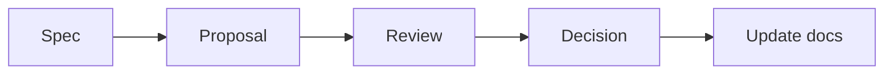

# Resonance — Documentation Workflow & Agent Handoff

> 상태: Working protocol v1.0  
> 기준일: 2026-09-14

## 1. Source of truth

제품의 기준은 Markdown 문서와 Git 이력이다. Figma, 다이어그램, 목업, 구현 코드는 서로 다른 목적을 가지며 어느 하나가 문서의 미확정 정책을 조용히 확정하면 안 된다.

| 산출물 | 담당 내용 |
| --- | --- |
| Product docs | 범위, IA, 흐름, 기능 정책, 수용 기준 |
| Design docs / Figma | 레이아웃, 컴포넌트, 상태, 반응형 동작, 프로토타입 |
| Architecture docs | 데이터 모델, API, 수집 파이프라인, 권한, 운영 경계 |
| Code and tests | 승인된 문서의 구현과 검증 |
| Decision log | 선택의 이유, 대안, 상태, 영향 문서 |

기획·디자인·개발 문서는 코드와 함께 같은 저장소에서 버전 관리하는 방향이 적합하다. 모바일과 PC·태블릿은 하나의 반응형 제품이므로 별도 앱 저장소로 분리할 이유가 현재는 없다.

## 2. 권장 문서 구조

```text
docs/
├─ product/
│  ├─ PRODUCT_BRIEF.md
│  ├─ IA.md
│  ├─ USER_FLOW.md
│  └─ FEATURE_SPECS/
├─ design/
│  ├─ DESIGN_SYSTEM.md
│  ├─ NAVIGATION_RULES.md
│  ├─ RESPONSIVE_RULES.md
│  ├─ INTERACTION_STATES.md
│  └─ SCREEN_SPECS/
├─ data/
│  ├─ DATA_CONTENT_MODEL.md
│  ├─ INGESTION_PIPELINE.md
│  └─ RECOMMENDATION_SYSTEM.md
├─ engineering/
│  ├─ ARCHITECTURE.md
│  ├─ API_CONTRACTS.md
│  └─ ADR/
└─ DECISION_LOG.md
```

현재 문서 묶음은 위 구조로 옮기기 전의 기준 원본이다. 이동할 때 내용을 임의로 요약하거나 의미를 바꾸지 않는다.

## 3. 에이전트 역할

### Planning

- 제품 범위와 우선순위
- IA와 User Flow
- 기능 명세와 수용 기준
- Open Question과 Decision Request 관리

### Design

- Navigation, Responsive, Interaction States
- 컴포넌트와 화면 명세
- Figma prototype
- 접근성·콘텐츠 우선순위

### Development

- 아키텍처, API, DB, 인증·권한
- 수집·검증·추천 파이프라인
- 코드, 테스트, 관찰 가능성
- 기술 제약과 구현 위험 제안

### Orchestrator

- 작업에 필요한 문서만 각 역할에 제공
- 충돌 탐지
- 승인되지 않은 범위 확장 차단
- 결정 후 영향받는 문서를 함께 갱신

## 4. 협업 절차



1. **Spec:** 현재 기준, 목표, 제약, 미확정 항목을 읽는다.
2. **Proposal:** 자신의 담당 영역에서 변경안을 제시하고 영향 문서를 적는다.
3. **Review:** 다른 영역과 충돌, 범위 증가, 데이터·기술 위험을 검토한다.
4. **Decision:** 사용자가 확정하거나 보류·폐기한다.
5. **Update:** IA, Flow, Design, Data, Architecture, Decision Log 중 영향받는 모든 문서를 갱신한다.

## 5. 변경 권한 규칙

- Planning agent는 기술 제약을 이유로 제품 목표를 임의 축소하지 않는다.
- Design agent는 목업을 만들면서 메뉴·기능·공개 범위를 추가하지 않는다.
- Development agent는 편의를 이유로 미확정 정책을 데이터 모델에 고정하지 않는다.
- 어떤 agent도 다른 영역의 결정을 조용히 바꾸지 않는다.
- 충돌이나 새로운 선택이 필요하면 `Decision Request`로 올린다.

## 6. Decision Request 형식

```markdown
# DR-XXX 제목

- 상태: Proposed / Accepted / Rejected / Deferred
- 배경:
- 결정이 필요한 질문:
- 선택지:
- 권장안과 이유:
- 제품 영향:
- 디자인 영향:
- 데이터·개발 영향:
- 영향받는 문서:
```

## 7. 구현 작업의 입력 단위

한 작업에 모든 문서를 무조건 넣지 않는다. 예:

| 작업 | 필수 입력 |
| --- | --- |
| Concert Taste 온보딩 | Product Spec, User Flow, relevant Screen Spec, data contract |
| 좌석 추천 API | Recommendation System, Seat data model, API contract, test fixtures |
| Figma Seat 화면 | IA, User Flow addendum, Design/Interaction, mockups |
| 후기 CRUD | Product Spec, Review flow, schema, auth policy, acceptance tests |

## 8. Figma handoff 규칙

Figma 요청에는 우선순위를 명시한다.

1. IA와 Product Spec: 화면·메뉴·기능 범위
2. User Flow: 이동·행동·분기
3. Design/Interaction: 상태와 반응형 규칙
4. 목업: 색, 타이포그래피, LP, 여백, 분위기

Figma 산출물은 editable native layers, components, variants, Auto Layout, responsive frames, prototype connections, Open Questions 주석을 포함해야 한다.

## 9. 완료 정의

기능 작업은 다음이 모두 충족되어야 완료다.

- 최신 Decision을 위반하지 않는다.
- 모바일·태블릿·데스크톱의 핵심 동작이 정의된다.
- loading, empty, error, partial data 상태가 있다.
- 입력 검증과 권한 경계가 있다.
- 데이터 출처와 추천 근거를 추적할 수 있다.
- 자동 테스트 또는 검증 절차가 있다.
- 바뀐 문서와 Decision Log가 함께 갱신된다.

## 10. 현재 주의할 충돌

- 기존 IA/User Flow의 Open Question 중 일부는 이미 해결되었다. `06_DECISION_LOG_AND_OPEN_QUESTIONS.md`를 우선한다.
- 일부 목업의 `All Events`, 타인 후기, 고정 추천 유형은 최신 범위가 아니다.
- 좌석 번호 추천은 제품 목표지만 실시간 구매 가능 좌석 추천은 아니다.
- LP의 playing 디자인은 확정 방향이지만 실제 음원 제공자는 미확정이다.
- 기술 스택은 제안 상태이므로 구현 시작 전에 ADR로 확정한다.

