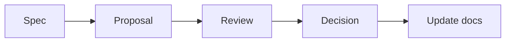

# Resonance — Documentation Workflow & Agent Handoff

> 상태: Working protocol v1.2
> 기준일: 2026-09-15

## 1. Source of truth

제품의 기준은 Markdown 문서와 Git 이력이다. Figma, 다이어그램, 목업, 구현 코드는 서로 다른 목적을 가지며 어느 하나가 문서의 미확정 정책을 조용히 확정하면 안 된다.

| 산출물 | 담당 내용 |
| --- | --- |
| Product docs | 범위, IA, 흐름, 기능 정책, 수용 기준 |
| Design docs / Figma | 레이아웃, 컴포넌트, 상태, 반응형 동작, 프로토타입 |
| Architecture docs | 데이터 모델, API, 수집 파이프라인, 권한, 운영 경계 |
| Code and tests | 승인된 문서의 구현과 검증 |
| Decision log | 선택의 이유, 대안, 상태, 영향 문서 |

기획·디자인·개발 문서는 코드와 함께 같은 저장소에서 버전 관리하는 방향이 적합하다. 모바일과 PC·태블릿은 하나의 반응형 제품이므로 별도 앱 저장소로 분리할 이유가 현재는 없다.

## 2. 권장 문서 구조

아래 트리는 과거의 구조 제안이며 실제 파일 목록이나 이동 지시가 아니다. 현행 경로는 [기존 인덱스](../00_README.md)를 따른다. 트리의 미생성 문서는 링크 대상으로 간주하지 않으며, 동등한 인덱스·결정 로그·협업 문서를 추가하지 않는다.

```text
docs/
├─ product/
│  ├─ PRODUCT_BRIEF.md
│  ├─ IA.md
│  ├─ USER_FLOW.md
│  └─ FEATURE_SPECS/
├─ design/
│  ├─ DESIGN_SYSTEM.md
│  ├─ NAVIGATION_RULES.md
│  ├─ RESPONSIVE_RULES.md
│  ├─ INTERACTION_STATES.md
│  └─ SCREEN_SPECS/
├─ data/
│  ├─ DATA_CONTENT_MODEL.md
│  ├─ INGESTION_PIPELINE.md
│  └─ RECOMMENDATION_SYSTEM.md
├─ engineering/
│  ├─ ARCHITECTURE.md
│  ├─ API_CONTRACTS.md
│  └─ ADR/
└─ DECISION_LOG.md
```

현재 문서 묶음을 기준 원본으로 보존한다. 별도 작업에서 이동을 요청받는 경우에도 내용을 임의로 요약하거나 의미를 바꾸지 않는다.

## 3. 에이전트 역할

### Planning

- 제품 범위와 우선순위
- IA와 User Flow
- 기능 명세와 수용 기준
- Open Question과 Decision Request 관리

### Design

- Navigation, Responsive, Interaction States
- 컴포넌트와 화면 명세
- Figma prototype
- 접근성·콘텐츠 우선순위

### Development

- 아키텍처, API, DB, 인증·권한
- 수집·검증·추천 파이프라인
- 코드, 테스트, 관찰 가능성
- 기술 제약과 구현 위험 제안

### Orchestrator

- 작업에 필요한 문서만 각 역할에 제공
- 충돌 탐지
- 승인되지 않은 범위 확장 차단
- 결정 후 영향받는 문서를 함께 갱신

## 4. 협업 절차



1. **Spec:** 현재 기준, 목표, 제약, 미확정 항목을 읽는다.
2. **Proposal:** 자신의 담당 영역에서 변경안을 제시하고 영향 문서를 적는다.
3. **Review:** 다른 영역과 충돌, 범위 증가, 데이터·기술 위험을 검토한다.
4. **Decision:** 사용자가 확정하거나 보류·폐기한다.
5. **Update:** IA, Flow, Design, Data, Architecture, Decision Log 중 영향받는 모든 문서를 갱신한다.

## 5. 변경 권한 규칙

- Planning agent는 기술 제약을 이유로 제품 목표를 임의 축소하지 않는다.
- Design agent는 목업을 만들면서 메뉴·기능·공개 범위를 추가하지 않는다.
- Development agent는 편의를 이유로 미확정 정책을 데이터 모델에 고정하지 않는다.
- 어떤 agent도 다른 영역의 결정을 조용히 바꾸지 않는다.
- 충돌이나 새로운 선택이 필요하면 `Decision Request`로 올린다.

## 6. Decision Request 형식

```markdown
# DR-XXX 제목

- 상태: Proposed / Accepted / Rejected / Deferred
- 배경:
- 결정이 필요한 질문:
- 선택지:
- 권장안과 이유:
- 제품 영향:
- 디자인 영향:
- 데이터·개발 영향:
- 영향받는 문서:
```

## 7. 구현 작업의 입력 단위

한 작업에 모든 문서를 무조건 넣지 않는다. 예:

| 작업 | 필수 입력 |
| --- | --- |
| Concert Taste 온보딩 | Product Spec, User Flow, relevant Screen Spec, data contract |
| 좌석 추천 API | Recommendation System, Seat data model, API contract, test fixtures |
| Figma Seat 화면 | [IA](../product/IA.md), [통합 User Flow](../product/USER_FLOW.md), [Design System](../design/DESIGN_SYSTEM.md), [Responsive](../design/RESPONSIVE.md), [Interaction](../design/INTERACTION.md), [자산 지도](../design/REFERENCE_MAP.md) |
| 후기 CRUD | Product Spec, Review flow, schema, auth policy, acceptance tests |

## 8. Figma handoff 규칙

Figma 요청에는 우선순위를 명시한다.

1. 최신 명시적 사용자 결정과 Decision Log: 확정 상태와 적용 범위
2. IA와 Product Spec: 화면·메뉴·기능 범위
3. User Flow: 이동·행동·분기
4. Design System / Responsive / Interaction: 시각, 상태와 반응형 규칙
5. 목업: 색, 타이포그래피, LP, 여백, 분위기

Figma 산출물은 editable native layers, components, variants, Auto Layout, responsive frames, prototype connections, Open Questions 주석을 포함해야 한다.

## 9. 완료 정의

기능 작업은 다음이 모두 충족되어야 완료다.

- 최신 Decision을 위반하지 않는다.
- 모바일·태블릿·데스크톱의 핵심 동작이 정의된다.
- loading, empty, error, partial data 상태가 있다.
- 입력 검증과 권한 경계가 있다.
- 데이터 출처와 추천 근거를 추적할 수 있다.
- 자동 테스트 또는 검증 절차가 있다.
- 바뀐 문서와 Decision Log가 함께 갱신된다.

## 10. 현재 주의할 충돌

- 기존 IA/User Flow의 Open Question 중 일부는 이미 해결되었다. [DECISION_LOG_AND_OPEN_QUESTIONS.md](../decisions/DECISION_LOG_AND_OPEN_QUESTIONS.md)를 우선한다.
- 일부 목업의 `All Events`, 타인 후기, 고정 추천 유형은 최신 범위가 아니다.
- 좌석 번호 추천은 제품 목표지만 실시간 구매 가능 좌석 추천은 아니다.
- LP는 실제 playback UI이고 음원은 Apple Music / Apple Music Classical 계열로 한정한다. MusicKit 구현 세부는 미확정이다.
- 기술 스택은 제안 상태이므로 구현 시작 전에 기존 Decision Log의 Decision Request로 확정한다.

문서 우선순위는 [결정 로그](../decisions/DECISION_LOG_AND_OPEN_QUESTIONS.md)의 DR-001 Accepted를 따른다. 재진입은 DR-002에서 결정된 부분과 보호된 deep link Open Question을 구분하고, 후기·입력 손실 충돌은 DR-003~004를 따른다. 별도 결정 로그를 자동 생성하지 않는다.

## 11. Codex 작업과 문서 검증

실행 진입점은 [루트 AGENTS](../../AGENTS.md), 작업 입력은 [템플릿](../tasks/TEMPLATE.md)과 [P-001](../tasks/P-001.md)이다. 문서를 완성한 상태와 앱 구현을 완료한 상태를 구분한다.

저장소 루트에서 Python 3.11 이상으로 실행한다. 아래 Python 의존성은 문서 검사 도구 전용이며 앱 스택 선택이 아니다.

의존성 목록은 [requirements-docs.txt](../../scripts/requirements-docs.txt), 회귀 테스트는 [test_check_docs.py](../../scripts/tests/test_check_docs.py)에 있다.

```sh
python3 -m venv /tmp/resonance-docs-venv
/tmp/resonance-docs-venv/bin/python -m pip install -r scripts/requirements-docs.txt
/tmp/resonance-docs-venv/bin/python scripts/check_docs.py
/tmp/resonance-docs-venv/bin/python -m unittest discover -s scripts/tests -v
git diff --check
```

[검사기](../../scripts/check_docs.py)는 저장소의 Markdown 링크·이미지 및 HTML의 href/src를 문서 위치 기준으로 검사한다. 공백·한글·URL 인코딩과 reference-style 링크를 지원한다. 루트 절대 경로와 저장소 밖 경로는 실패한다. URL query/fragment는 파일 존재 검사에서 제거하며 제목 anchor의 유효성은 검사하지 않는다. 외부 URL은 네트워크 요청 없이 제외한다.

코드 블록·인라인 코드의 예시/역사적 파일명은 검사하지 않는다. 실제로 필요한 문서·자산은 상대 링크로 작성한다. 미확보 자산은 [자산 지도](../design/REFERENCE_MAP.md)에 `누락`으로 기록하고 가짜 링크를 만들지 않는다. `.git`, 의존성·빌드·캐시 디렉터리는 검사에서 제외한다. 링크가 유효하다는 사실은 정책 정합성이나 자산 사용 권한을 보증하지 않는다.

[GitHub Actions](../../.github/workflows/docs-check.yml)는 push, pull request, 수동 실행에서 같은 문서 검사와 회귀 테스트를 실행하고 신규 범위의 파일 정책·비밀정보·커밋 메시지를 재검사한다. 로컬 파일만으로 성공하지 않도록 공유할 링크 대상도 변경 사항에 포함하고, 최종 보고에 명령·종료 결과·미실행 항목을 적는다.

## 12. 기반 작업 검증 기록

2026-09-15 문서·자동화 기반 작업. 앱 구현은 수행하지 않았다.

| 검증 | 실제 결과 |
| --- | --- |
| 문서 검사 | Python 3.13.3에서 Markdown 14개, 로컬 참조 128개, 오류 0개 |
| 검사기 회귀 테스트 | 12개 통과; 누락 문서·이미지 실패, 경로 복구 후 성공, 상대/한글/공백/reference-style/HTML 링크, 코드·외부 URL 제외 확인 |
| 변경 공백 검사 | `git diff --check` 통과 |
| Workflow 구문 | Ruby YAML 파서로 구문 검사 통과; actionlint는 설치되어 있지 않아 미실행 |
| 원격 GitHub Actions | workflow 작성 완료; push·원격 실행은 이번 작업에서 수행하지 않음 |
| 앱·PWA 동작 | 미실행; P-001은 기술 선택 T-01 이후 착수 |

변경 범위는 기존 인덱스·IA·Flow·이 협업 문서·결정 로그의 참조 및 감사 기록과 AGENTS, 작업 템플릿/P-001, 자산 지도, PWA 범위, 문서 검사 스크립트·테스트·workflow다. 기존 분야별 기획 원문은 보존했다. 처음 관찰한 미추적 PNG 네 장은 최종 재점검에서 없었으며, 현재 자산 누락으로 기록했다. 이 작업에서는 이미지 파일을 변경하지 않았다. 남은 제품 충돌은 DR-001~004, 다음 실행은 P-001 7절을 따른다.

## 13. Git 커밋과 파일 추적 정책

### 13.1 기준과 작업 경계

2026-09-15 정비 기준은 브랜치 `main`, HEAD `1f2594d3ed1d5aae2c5ecdb8ea0c7e725f6476c5`이며 `origin/main`과 일치한다. 작업 시작과 종료에 브랜치·HEAD·상태를 확인하고 기존 사용자 변경을 보존한다. 관계없는 파일을 함께 고치거나 되돌리지 않는다.

스테이징은 `git add <정확한 경로>`로 작업 관련 파일만 선택한다. `git add .`과 `git add -A`를 기본 절차로 사용하지 않는다. 커밋 전에는 다음을 확인한다.

```sh
git status --short --branch
git diff --cached --stat
git diff --cached
git diff --cached --check
python3 scripts/run_git_checks.py pre-commit
```

푸시 전에는 대상 원격 브랜치를 기준으로 `git log --oneline <base>..HEAD`와 `git diff --stat <base>...HEAD`를 확인해 실제로 공유할 커밋과 파일 범위를 검토한다. `git add -f`, `--no-verify`, hook·CI·검사 비활성화로 정책을 우회하지 않는다. 필수 검증 실패를 남긴 채 커밋·푸시하지 않으며 공유 이력 재작성과 force push를 기본 절차로 사용하지 않는다.

### 13.2 커밋 메시지와 단위

Conventional Commits의 `type(scope): 요약` 형식을 사용하며 scope는 선택 사항이다. type과 scope는 영문으로 쓰고 요약과 본문은 한국어를 사용할 수 있다.

허용 type은 `feat`, `fix`, `docs`, `style`, `refactor`, `perf`, `test`, `build`, `ci`, `chore`, `revert`다. `style`은 동작을 바꾸지 않는 코드 서식 변경에만 사용한다. 화면 기능·디자인 변경은 실제 목적에 따라 `feat`, `fix`, `refactor` 등을 사용한다. 한 커밋에는 하나의 논리적 변경만 포함하고 작업 ID가 있으면 본문에 `Task: P-001`처럼 기록한다. 과거 커밋 메시지는 재작성하지 않는다.

### 13.3 추적 대상과 제외 대상

| 분류 | 정책과 경로 |
| --- | --- |
| 유지 | 소스, 문서, lockfile, DB 스키마·마이그레이션, 합성 테스트 fixture, 앱에서 사용하는 자산, 디자인 기준 자료 |
| 보안 | 실제 `.env`와 API 키·OAuth 토큰·개인키·서비스 계정 인증정보·쿠키·Playwright 인증 상태는 금지. 값 없는 `.env.example` placeholder만 허용 |
| 개인정보 | 실제 사용자 후기·계정·취향 내보내기, 운영 DB 덤프, 개인 대화 원문은 `/.local-data/` 또는 외부 보관소에 두고 추적 금지 |
| 재생성 가능 | `node_modules`, `.next`, `out`, `dist`, `coverage`, 테스트 결과·영상·trace, 로그·캐시, Python 가상환경·바이트코드, `*.tsbuildinfo`, `next-env.d.ts` 제외 |
| 로컬 설정 | `.DS_Store`, 임시·swap 파일, 개인 `.idea`와 `.vscode` 상태 제외. 팀 공용 `.vscode/settings.json`·`extensions.json`은 비밀이나 개인 경로가 없을 때만 별도 검토 후 허용 |
| 원본·대용량 | 수집 공연 이미지·OCR 원본·크롤링 덤프·데이터셋·모델 가중치·미디어 원본·백업은 `/.local-assets/`, `/.local-data/` 또는 외부 보관소에 두고 추적 금지 |

[루트 `.gitignore`](../../.gitignore)는 목적별로 구체적인 디렉터리와 파일명만 제외한다. `*.json`, `*.csv`, `*.png`, `*.sql`, `data/`처럼 필요한 자료까지 막는 광범위 규칙은 두지 않는다. 원본·대용량 자료가 필요하면 관련 작업 문서나 [Reference Map](../design/REFERENCE_MAP.md)에 외부 보관 위치·객체 ID, checksum, 출처·권리, 재현 또는 재수집 방법만 기록한다. 원본과 개인정보는 문서에 복사하지 않는다.

PWA manifest·아이콘·직접 작성한 service worker는 소스이므로 추적한다. 현재 PWA 자동 생성 도구와 별도 생성 경로는 없으며, 추후 도구가 실제로 만든 출력 경로를 확인한 뒤 그 경로만 제외한다.

### 13.4 자산, 캡처와 크기 제한

`docs/design/references/` 목업, `public/images/resonance-vinyl.png`, `docs/tasks/P-001-captures/`의 선택된 증거는 문서 또는 앱에서 사용하므로 유지한다. 일반 Playwright 실행은 무시되는 `test-results/p001-captures/`에 캡처를 쓴다. 검토자가 결과를 육안 비교한 다음 필요한 파일만 동일한 이름의 문서 증거 경로로 복사하고, 그 경로만 선택적으로 스테이징한다. 테스트 실행 자체는 추적 증거를 덮어쓰지 않는다.

새 Git blob은 5MiB(`5 * 1024 * 1024` bytes) 초과 시 차단한다. 로컬 스테이징은 [Git 정책 검사기](../../scripts/check_git_policy.py)가 working tree가 아닌 Git index의 stage 0 blob을 직접 읽어 검사한다. push와 CI는 신규 커밋마다 실제 변경 경로와 blob을 검사하므로 중간 커밋에서 추가됐다가 삭제된 파일과 기존 blob을 금지 경로로 이름 변경한 경우도 차단한다. 현재 예외는 없다. 꼭 필요한 비민감 자산의 예외는 사용자 승인 후에만 경로·이유·외부 보관 위치·축소 불가 사유·갱신 방식을 이 절에 기록하고 검사기 allowlist를 함께 변경한다. 비밀정보는 크기와 무관하게 예외로 허용하지 않는다.

### 13.5 비밀정보 사고 대응

비밀 값은 응답, 터미널 출력, 로그, 문서, 커밋 메시지에 표시하지 않는다. 공개 이력에서 의심 파일을 발견하면 값 대신 경로·커밋 범위·추적 상태만 보고하고 해당 자격증명을 즉시 폐기·재발급해야 함을 알린다. 이력 정리는 일반 수정과 분리해 영향받는 협업자·배포·fork를 확인하고 사용자 승인 아래 별도 작업으로 수행한다. 비밀 삭제를 이유로 이번 정책 작업에서 공유 이력을 임의 재작성하거나 force push하지 않는다.

### 13.6 로컬 훅과 검사기

비밀정보 검사는 검증된 오픈 소스 스캐너 [Gitleaks](https://github.com/gitleaks/gitleaks)를 사용한다. [공식 릴리스](https://github.com/gitleaks/gitleaks/releases)의 `8.30.0` 바이너리와 플랫폼별 SHA-256을 [설치 스크립트](../../scripts/install_gitleaks.py)에 고정했다. 다운로드 결과의 checksum과 실행 버전이 모두 일치해야 무시되는 `/.tools/`에 설치된다. 도구가 없거나 버전이 다르면 검사를 통과시키지 않는다.

새 clone과 새 Codex 실행 환경은 저장소 루트에서 다음을 실행한다. 두 번째 명령은 `core.hooksPath`를 이 저장소의 local config에만 설정한다. 유효한 local 또는 global 기존 값이 있으면 [설치 스크립트](../../scripts/install_git_hooks.py)가 `.git/resonance-hooks/`에 통합 훅을 만들고 기존 훅을 먼저 실행한다. pre-push의 ref 입력은 권한 제한 임시 파일을 통해 두 훅에 동일하게 전달한다. 추적된 [pre-commit](../../.githooks/pre-commit), [commit-msg](../../.githooks/commit-msg), [pre-push](../../.githooks/pre-push) 파일만 clone하는 것으로는 훅이 활성화되지 않는다.

```sh
python3 scripts/install_gitleaks.py
python3 scripts/install_git_hooks.py
git config --local --get core.hooksPath
```

`pre-commit`은 삭제 항목을 제외한 정확한 staged blob의 경로·내용·크기를 검사하므로 부분 스테이징을 보존하고 `git add -f`도 우회가 되지 않는다. Gitleaks 결과는 값을 100% 마스킹하고 경로·규칙·커밋 또는 줄 위치만 출력하며 임시 JSON 보고서는 종료 시 제거한다. `commit-msg`는 13.2의 subject 형식을 검사한다. `pre-push`는 Git이 전달한 실제 local/remote ref를 읽어 새 브랜치, upstream 없는 브랜치, 여러 ref와 ref 삭제를 처리하고, 기존 원격 브랜치에 대한 non-fast-forward push는 차단한다. 새 ref는 정책 기준 커밋 `1f2594d3ed1d5aae2c5ecdb8ea0c7e725f6476c5` 이후의 도달 가능한 커밋을 검사하며, 기준 커밋이 로컬에 없으면 누락 없이 해당 ref의 전체 이력을 검사한다.

수동 확인 진입점은 다음과 같다. 전체 이력 감사는 기존 공유 이력의 비민감 위반과 과거 메시지도 보고하므로 정책 도입 커밋 전에는 실패할 수 있으며, 이를 고치기 위해 공유 이력을 재작성하지 않는다.

```sh
python3 scripts/run_git_checks.py pre-commit
python3 scripts/run_git_checks.py audit
```

### 13.7 CI와 서버 측 보호

[기존 docs-check workflow](../../.github/workflows/docs-check.yml)는 전체 이력을 checkout하고 최소 `contents: read` 권한으로 동작한다. pull request는 base SHA부터 head SHA까지, 일반 push는 before SHA부터 after SHA까지 검사한다. 새 branch push와 수동 실행은 13.6의 정책 기준 이후 범위를 사용하고 기준이 없으면 전체 이력을 검사한다. ref 삭제 push는 새 Git 객체가 없음을 명시하고 스캐너 설치 상태만 확인한다. 파일 정책·Gitleaks·신규 커밋 메시지를 모두 실행하며 비밀 원문 보고서를 artifact로 업로드하지 않는다.

CI는 push 후 실행되므로 로컬 훅이나 GitHub의 secret scanning push protection을 대체하지 않는다. 저장소 파일로 확인할 수 없는 서버 설정인 GitHub secret scanning과 push protection 활성화, 기본 브랜치 보호, docs-check를 필수 status check로 지정, force push와 branch deletion 제한은 이번 작업에서 적용 여부를 확인하거나 변경하지 않았다. 관리자가 GitHub 설정에서 별도로 확인해야 한다.

2026-09-15 정책 도입 전 공유 이력 전체 감사에서는 비밀정보 탐지 없이 `.DS_Store`와 `next-env.d.ts`의 비민감 경로 위반, Conventional Commits 형식이 아닌 기존 커밋 두 개를 확인했다. 두 파일은 로컬 원본을 유지한 채 다음 커밋에서 추적 해제하도록 index에 반영되어 있다. 이 결과 때문에 과거 커밋 메시지나 공유 이력을 재작성하지 않는다.
