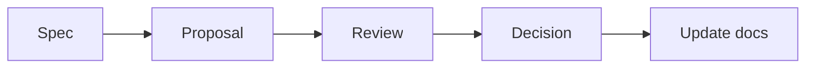

# Resonance — Documentation Workflow & Agent Handoff

> 상태: Working protocol v1.0  
> 기준일: 2026-09-14

## 1. Source of truth

제품의 기준은 Markdown 문서와 Git 이력이다. Figma, 다이어그램, 목업, 구현 코드는 서로 다른 목적을 가지며 어느 하나가 문서의 미확정 정책을 조용히 확정하면 안 된다.

| 산출물 | 담당 내용 |
| --- | --- |
| Product docs | 범위, IA, 흐름, 기능 정책, 수용 기준 |
| Design docs / Figma | 레이아웃, 컴포넌트, 상태, 반응형 동작, 프로토타입 |
| Architecture docs | 데이터 모델, API, 수집 파이프라인, 권한, 운영 경계 |
| Code and tests | 승인된 문서의 구현과 검증 |
| Decision log | 선택의 이유, 대안, 상태, 영향 문서 |

기획·디자인·개발 문서는 코드와 함께 같은 저장소에서 버전 관리하는 방향이 적합하다. 모바일과 PC·태블릿은 하나의 반응형 제품이므로 별도 앱 저장소로 분리할 이유가 현재는 없다.

## 2. 권장 문서 구조

아래 트리는 과거의 구조 제안이며 실제 파일 목록이나 이동 지시가 아니다. 현행 경로는 [기존 인덱스](../00_README.md)를 따른다. 트리의 미생성 문서는 링크 대상으로 간주하지 않으며, 동등한 인덱스·결정 로그·협업 문서를 추가하지 않는다.

```text
docs/
├─ product/
│  ├─ PRODUCT_BRIEF.md
│  ├─ IA.md
│  ├─ USER_FLOW.md
│  └─ FEATURE_SPECS/
├─ design/
│  ├─ DESIGN_SYSTEM.md
│  ├─ NAVIGATION_RULES.md
│  ├─ RESPONSIVE_RULES.md
│  ├─ INTERACTION_STATES.md
│  └─ SCREEN_SPECS/
├─ data/
│  ├─ DATA_CONTENT_MODEL.md
│  ├─ INGESTION_PIPELINE.md
│  └─ RECOMMENDATION_SYSTEM.md
├─ engineering/
│  ├─ ARCHITECTURE.md
│  ├─ API_CONTRACTS.md
│  └─ ADR/
└─ DECISION_LOG.md
```

현재 문서 묶음을 기준 원본으로 보존한다. 별도 작업에서 이동을 요청받는 경우에도 내용을 임의로 요약하거나 의미를 바꾸지 않는다.

## 3. 에이전트 역할

### Planning

- 제품 범위와 우선순위
- IA와 User Flow
- 기능 명세와 수용 기준
- Open Question과 Decision Request 관리

### Design

- Navigation, Responsive, Interaction States
- 컴포넌트와 화면 명세
- Figma prototype
- 접근성·콘텐츠 우선순위

### Development

- 아키텍처, API, DB, 인증·권한
- 수집·검증·추천 파이프라인
- 코드, 테스트, 관찰 가능성
- 기술 제약과 구현 위험 제안

### Orchestrator

- 작업에 필요한 문서만 각 역할에 제공
- 충돌 탐지
- 승인되지 않은 범위 확장 차단
- 결정 후 영향받는 문서를 함께 갱신

## 4. 협업 절차



1. **Spec:** 현재 기준, 목표, 제약, 미확정 항목을 읽는다.
2. **Proposal:** 자신의 담당 영역에서 변경안을 제시하고 영향 문서를 적는다.
3. **Review:** 다른 영역과 충돌, 범위 증가, 데이터·기술 위험을 검토한다.
4. **Decision:** 사용자가 확정하거나 보류·폐기한다.
5. **Update:** IA, Flow, Design, Data, Architecture, Decision Log 중 영향받는 모든 문서를 갱신한다.

## 5. 변경 권한 규칙

- Planning agent는 기술 제약을 이유로 제품 목표를 임의 축소하지 않는다.
- Design agent는 목업을 만들면서 메뉴·기능·공개 범위를 추가하지 않는다.
- Development agent는 편의를 이유로 미확정 정책을 데이터 모델에 고정하지 않는다.
- 어떤 agent도 다른 영역의 결정을 조용히 바꾸지 않는다.
- 충돌이나 새로운 선택이 필요하면 `Decision Request`로 올린다.

## 6. Decision Request 형식

```markdown
# DR-XXX 제목

- 상태: Proposed / Accepted / Rejected / Deferred
- 배경:
- 결정이 필요한 질문:
- 선택지:
- 권장안과 이유:
- 제품 영향:
- 디자인 영향:
- 데이터·개발 영향:
- 영향받는 문서:
```

## 7. 구현 작업의 입력 단위

한 작업에 모든 문서를 무조건 넣지 않는다. 예:

| 작업 | 필수 입력 |
| --- | --- |
| Concert Taste 온보딩 | Product Spec, User Flow, relevant Screen Spec, data contract |
| 좌석 추천 API | Recommendation System, Seat data model, API contract, test fixtures |
| Figma Seat 화면 | [IA](../product/IA.md), [통합 User Flow](../product/USER_FLOW.md), [Design/Interaction](../design/DESIGN_AND_INTERACTION.md), [자산 지도](../design/REFERENCE_MAP.md) |
| 후기 CRUD | Product Spec, Review flow, schema, auth policy, acceptance tests |

## 8. Figma handoff 규칙

Figma 요청에는 우선순위를 명시한다.

1. IA와 Product Spec: 화면·메뉴·기능 범위
2. User Flow: 이동·행동·분기
3. Design/Interaction: 상태와 반응형 규칙
4. 목업: 색, 타이포그래피, LP, 여백, 분위기

Figma 산출물은 editable native layers, components, variants, Auto Layout, responsive frames, prototype connections, Open Questions 주석을 포함해야 한다.

## 9. 완료 정의

기능 작업은 다음이 모두 충족되어야 완료다.

- 최신 Decision을 위반하지 않는다.
- 모바일·태블릿·데스크톱의 핵심 동작이 정의된다.
- loading, empty, error, partial data 상태가 있다.
- 입력 검증과 권한 경계가 있다.
- 데이터 출처와 추천 근거를 추적할 수 있다.
- 자동 테스트 또는 검증 절차가 있다.
- 바뀐 문서와 Decision Log가 함께 갱신된다.

## 10. 현재 주의할 충돌

- 기존 IA/User Flow의 Open Question 중 일부는 이미 해결되었다. [DECISION_LOG_AND_OPEN_QUESTIONS.md](../decisions/DECISION_LOG_AND_OPEN_QUESTIONS.md)를 우선한다.
- 일부 목업의 `All Events`, 타인 후기, 고정 추천 유형은 최신 범위가 아니다.
- 좌석 번호 추천은 제품 목표지만 실시간 구매 가능 좌석 추천은 아니다.
- LP의 playing 디자인은 확정 방향이지만 실제 음원 제공자는 미확정이다.
- 기술 스택은 제안 상태이므로 구현 시작 전에 ADR로 확정한다.

우선순위 서술 차이는 [결정 로그](../decisions/DECISION_LOG_AND_OPEN_QUESTIONS.md)의 DR-001, 본문과 Open Questions의 충돌은 DR-002~DR-004를 따른다. 위의 ADR 절차와 기존 결정 로그의 관계도 DR-001에서 검토한다. 별도 결정 로그를 자동 생성하지 않는다.

## 11. Codex 작업과 문서 검증

실행 진입점은 [루트 AGENTS](../../AGENTS.md), 작업 입력은 [템플릿](../tasks/TEMPLATE.md)과 [P-001](../tasks/P-001.md)이다. 문서를 완성한 상태와 앱 구현을 완료한 상태를 구분한다.

저장소 루트에서 Python 3.11 이상으로 실행한다. 아래 Python 의존성은 문서 검사 도구 전용이며 앱 스택 선택이 아니다.

의존성 목록은 [requirements-docs.txt](../../scripts/requirements-docs.txt), 회귀 테스트는 [test_check_docs.py](../../scripts/tests/test_check_docs.py)에 있다.

```sh
python3 -m venv /tmp/resonance-docs-venv
/tmp/resonance-docs-venv/bin/python -m pip install -r scripts/requirements-docs.txt
/tmp/resonance-docs-venv/bin/python scripts/check_docs.py
/tmp/resonance-docs-venv/bin/python -m unittest discover -s scripts/tests -v
git diff --check
```

[검사기](../../scripts/check_docs.py)는 저장소의 Markdown 링크·이미지 및 HTML의 href/src를 문서 위치 기준으로 검사한다. 공백·한글·URL 인코딩과 reference-style 링크를 지원한다. 루트 절대 경로와 저장소 밖 경로는 실패한다. URL query/fragment는 파일 존재 검사에서 제거하며 제목 anchor의 유효성은 검사하지 않는다. 외부 URL은 네트워크 요청 없이 제외한다.

코드 블록·인라인 코드의 예시/역사적 파일명은 검사하지 않는다. 실제로 필요한 문서·자산은 상대 링크로 작성한다. 미확보 자산은 [자산 지도](../design/REFERENCE_MAP.md)에 `누락`으로 기록하고 가짜 링크를 만들지 않는다. `.git`, 의존성·빌드·캐시 디렉터리는 검사에서 제외한다. 링크가 유효하다는 사실은 정책 정합성이나 자산 사용 권한을 보증하지 않는다.

[GitHub Actions](../../.github/workflows/docs-check.yml)는 push, pull request, 수동 실행에서 같은 검사와 회귀 테스트를 실행한다. 로컬 파일만으로 성공하지 않도록 공유할 링크 대상도 변경 사항에 포함하고, 최종 보고에 명령·종료 결과·미실행 항목을 적는다.

## 12. 기반 작업 검증 기록

2026-09-15 문서·자동화 기반 작업. 앱 구현은 수행하지 않았다.

| 검증 | 실제 결과 |
| --- | --- |
| 문서 검사 | Python 3.13.3에서 Markdown 14개, 로컬 참조 128개, 오류 0개 |
| 검사기 회귀 테스트 | 12개 통과; 누락 문서·이미지 실패, 경로 복구 후 성공, 상대/한글/공백/reference-style/HTML 링크, 코드·외부 URL 제외 확인 |
| 변경 공백 검사 | `git diff --check` 통과 |
| Workflow 구문 | Ruby YAML 파서로 구문 검사 통과; actionlint는 설치되어 있지 않아 미실행 |
| 원격 GitHub Actions | workflow 작성 완료; push·원격 실행은 이번 작업에서 수행하지 않음 |
| 앱·PWA 동작 | 미실행; P-001은 기술 선택 T-01 이후 착수 |

변경 범위는 기존 인덱스·IA·Flow·이 협업 문서·결정 로그의 참조 및 감사 기록과 AGENTS, 작업 템플릿/P-001, 자산 지도, PWA 범위, 문서 검사 스크립트·테스트·workflow다. 기존 분야별 기획 원문은 보존했다. 처음 관찰한 미추적 PNG 네 장은 최종 재점검에서 없었으며, 현재 자산 누락으로 기록했다. 이 작업에서는 이미지 파일을 변경하지 않았다. 남은 제품 충돌은 DR-001~004, 다음 실행은 P-001 7절을 따른다.
