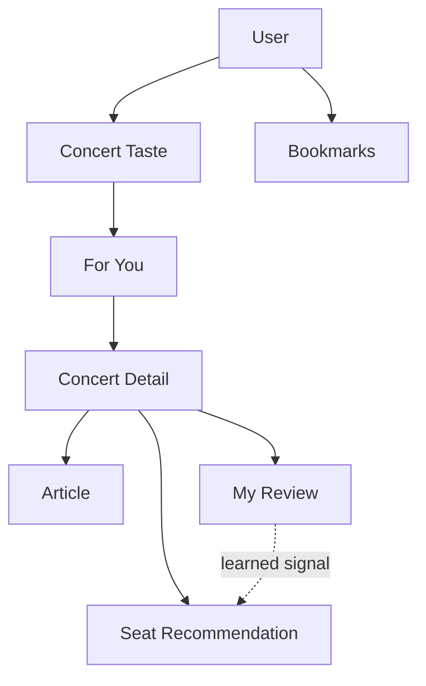

# Resonance — Information Architecture

> 문서 상태: Working Baseline v0.4
> 기준일: 2026-09-15  
> 제품: 클래식 공연 추천·좌석 추천·아티클·개인 후기 아카이빙 반응형 웹앱  
> 대체 문서: `IA_rsn.md` Draft v0.2 (저장소에 없는 역사적 원본명)\
> 목적: 화면, 콘텐츠, 기능 및 사용자 데이터 사이의 구조를 정의하고 User Flow, 기능 명세, 디자인 및 개발의 기준으로 사용한다.

## 1. 문서 해석 기준

| 구분 | 의미 |
| --- | --- |
| 확정 | 사용자가 명시적으로 결정했으며 현재 설계와 구현이 따라야 하는 내용 |
| MVP 잠정 | MVP 기준으로 우선 채택했지만 최종 데이터 계약 전에 재검토가 필요한 내용 |
| 목업 관찰 | 목업에서 확인되지만 기능·정책까지 확정되지는 않은 표현 |
| Later | 장기 제품 방향에는 남지만 MVP에는 포함하지 않는 내용 |
| Open Question | 아직 결정되지 않아 임의로 구현해서는 안 되는 내용 |

목업에만 존재하는 요소나 이전 제안은 자동으로 확정 기능이 되지 않는다. 이 문서와 세부 문서가 충돌하면 사용자의 최신 명시적 결정과 Decision Log를 우선한다.

이 우선순위와 인덱스의 차이는 [결정 로그](../decisions/DECISION_LOG_AND_OPEN_QUESTIONS.md)의 DR-001에서 검토 중이다.

## 2. 제품 정의와 범위

Resonance는 사용자가 보고 싶은 클래식 공연과 원하는 현장 경험을 이해해 공연과 좌석을 설명 가능한 방식으로 추천하고, 감상을 돕는 아티클과 개인 후기 기록을 하나의 흐름으로 연결하는 서비스다.

MVP의 핵심 기능은 다음 네 축이다.

1. `For You`: Concert Taste 기반 공연 발견 및 알림 이후의 탐색
2. `Seat Recommendation`: 공연·공연장·사용자 취향과 현재 관람 목적을 반영한 좌석 추천
3. `Articles`: 공연 전 감상을 돕는 작품·인물·역사·비평 콘텐츠
4. `Reviews`: 구조화된 평가와 자유 텍스트를 함께 보존하는 개인 후기 아카이브

모바일·태블릿·PC는 같은 데이터와 정보 구조를 사용하는 하나의 반응형 웹앱/PWA다. 기기별로 다른 제품이나 별도 저장소로 취급하지 않는다.

## 3. 확정된 IA 원칙

- 전역 1차 메뉴는 `For You`, `Articles`, `Reviews` 세 개뿐이다.
- 별도 `Alerts` 메뉴나 독립 알림 목록은 존재하지 않는다.
- `App Home`은 세 1차 메뉴와 구분되는 중립적 브랜드 홈이다.
- 신규 사용자는 Skip할 수 없는 `Concert Taste Onboarding`을 완료해야 한다.
- `Concert Taste`는 보고 싶은 콘텐츠와 원하는 공연 경험을 함께 다룬다.
- 유틸리티 기능은 햄버거 메뉴의 `Account`, `My Concert Taste`, `Bookmarks`, `Settings`로 접근한다.
- `For You`는 Concert Taste 기반 개인화 공연 피드다.
- 공연 알림을 선택하면 해당 `Concert Detail`로 직접 이동한다.
- `Concert Detail`은 공연 정보, 좌석 추천, 프로그램, 관련 아티클, 해당 공연의 내 후기를 연결하는 허브다.
- 좌석 추천은 지원 공연장에서 개별 좌석 번호 또는 번호 범위까지 제공한다.
- 좌석 추천은 하나의 절대적 최적안이 아니라 공연·취향·상황에 따른 복수안이다.
- 좌석 추천은 실시간 잔여석을 보장하지 않으며 예매는 외부 공식 예매처에서 진행한다.
- 공연과 아티클은 모두 Bookmarks에 저장할 수 있으며 서로 다른 탭에서 관리한다.
- `Reviews`는 공개 커뮤니티가 아니라 로그인 사용자가 소유한 개인 기록이다.
- 추천과 아티클의 근거가 되는 정보를 사용자가 다시 확인할 수 있어야 한다.
- MVP 인증은 Google, Sign in with Apple, email magic link를 제공한다.
- 전역 검색은 MVP에서 제외하며 기능 내부 검색만 허용한다.

## 4. 전체 사이트맵

```text
Resonance
├─ 비인증 영역
│  ├─ Splash
│  ├─ Public Landing
│  └─ Authentication
│     ├─ Sign In
│     └─ Get Started
│        └─ Concert Taste Onboarding — 필수
│           ├─ Apple Music 연결 — 우선 선택지, 별도 MusicKit 권한
│           └─ 취향 직접 입력하기 — 대안
│              ├─ Content Preferences
│              └─ Experience Preferences
│
└─ 인증 영역
   ├─ App Home — 중립 홈
   │
   ├─ 1차 영역
   │  ├─ For You
   │  │  └─ Concert Detail
   │  │     ├─ Overview
   │  │     ├─ Seat
   │  │     ├─ Program
   │  │     ├─ Articles
   │  │     │  └─ Article Detail
   │  │     └─ Reviews — 해당 공연의 내 후기만
   │  │        ├─ Review Detail
   │  │        └─ Write / Edit Review
   │  │
   │  ├─ Articles
   │  │  └─ Article Detail
   │  │
   │  └─ Reviews — 내 후기 아카이브
   │     ├─ Review Detail
   │     └─ Write / Edit Review
   │
   └─ 유틸리티 영역 — 햄버거 메뉴
      ├─ Account
      ├─ My Concert Taste
      │  ├─ Content Preferences
      │  └─ Experience Preferences
      ├─ Bookmarks
      │  ├─ Concerts
      │  └─ Articles
      └─ Settings
```

알림은 사이트맵 안의 독립 화면이 아니라 앱 외부 또는 시스템 수준의 진입점이다. 알림 선택 시 `Concert Detail`로 deep link한다.

## 5. 비인증 영역과 초기 진입

### 5.1 Splash

**목적**  
모바일 또는 PWA 실행 시 Resonance의 브랜드를 전달하는 진입 화면이다.

**확정된 시각 구조**

- LP 한 장을 중심 오브젝트로 사용한다.
- LP 중앙은 노란색 레이블이며 `resonance`를 표시한다.
- 화면 구성은 간결하게 유지한다.

Splash의 표시 시간과 다음 화면 전환 조건은 Open Question이다.

### 5.2 Public Landing

**목적**  
비로그인 사용자에게 서비스를 소개하고 인증으로 연결한다.

**진입점**

- `Sign In`
- `Get Started`

**목업 관찰 요소**

- 브랜드 메시지
- LP 비주얼
- `About`

### 5.3 Authentication

**목적**  
Concert Taste, Bookmarks, 추천 기록 및 개인 후기를 사용자 계정에 연결하고 보존한다.

MVP 인증 방식은 Google, Sign in with Apple, email magic link다. Resonance 자체 비밀번호를 별도로 관리하지 않는 방향이며 계정 연결·복구의 세부 정책은 Open Question이다.

### 5.4 Concert Taste Onboarding

**목적**  
신규 사용자가 공연 및 좌석 추천에 필요한 최소 취향 정보를 설정한다.

**확정 규칙**

- `Get Started` 흐름에 포함한다.
- Skip을 제공하지 않는다.
- Apple Music 연결을 첫 선택지로, 그 아래 `취향 직접 입력하기`를 대안으로 제공한다.
- Apple Music을 연결하지 않은 직접 입력 경로에서는 Preference를 최소 한 개 입력·선택해야 완료할 수 있다.
- 외부 음악 서비스 연결 없이 직접 입력만으로 완료할 수 있어야 한다.

#### Content Preferences

“무엇을 보고 싶은가?”를 나타낸다.

- 작곡가
- 작품
- 연주자·지휘자
- 악기
- 앙상블·공연 형식
- 음악적 스타일 또는 관심 키워드

카테고리는 작곡가, 작품, 연주자·지휘자, 악기, 앙상블·공연 형식, 음악적 스타일·관심 키워드로 고정한다. canonical entity가 있으면 검색 결과에서 선택하고 DB에 없는 맥락적 관심사는 free-text keyword로 추가할 수 있다.

#### Experience Preferences

“공연장에서 어떻게 경험하고 싶은가?”를 자연어로 입력한다.

조건부 취향을 고정 체크박스나 태그만으로 제한하지 않으며 자연어 원문을 보존한다. AI는 추천을 위한 구조화 해석을 만들 수 있지만 확인을 온보딩 필수 단계로 두지 않는다. 사용자는 `My Concert Taste`에서 선택적으로 해석을 확인·수정할 수 있다.

Apple Music 연결은 온보딩의 우선 입력 경로지만 필수 조건은 아니다. imported taste 확인 필요 여부, seed로 사용할 데이터, classical/non-classical 분류 기준은 Open Question이다. Sign in with Apple은 계정 인증이고 Apple Music 개인 데이터 접근은 별도 MusicKit 사용자 권한을 요구한다.

## 6. 인증 영역의 전역 화면

### 6.1 App Home

**목적**  
로그인 후 Resonance의 브랜드 경험을 제공하고 세 핵심 영역으로 연결하는 중립 홈이다.

**확정 구조**

- `For You`, `Articles`, `Reviews`로 이동할 수 있다.
- 어느 1차 메뉴도 선택 상태로 표시하지 않는다.
- 햄버거 메뉴로 유틸리티 영역에 접근한다.
- LP를 중심 브랜드 오브젝트로 사용한다.

**LP playback 구조**

- 기본 상태: 노란 `resonance` 레이블
- stylus를 LP play zone으로 옮기면 실제 음원을 재생하고 흑백 작곡가 또는 연주자 이미지를 표시한다.
- LP 선택은 Pause/Resume, stylus의 resting position 복귀는 Stop이다.
- track 종료 시 자동 Stop, 위치 초기화와 노란 레이블 복귀가 일어난다.

재생 소스는 Apple Music / Apple Music Classical 계열로 한정한다. 실제 MusicKit 지원 범위와 권한·catalog mapping은 engineering 검증 대상이다. 자세한 표현과 상태 전환은 [Design System](../design/DESIGN_SYSTEM.md)과 [Interaction](../design/INTERACTION.md)에서 다룬다.

### 6.2 햄버거 메뉴

햄버거 메뉴는 핵심 콘텐츠 탐색이 아닌 사용자·설정 성격의 기능을 제공한다.

| 메뉴 | 목적 |
| --- | --- |
| Account | 계정 정보 확인 및 관리 |
| My Concert Taste | 명시적으로 입력한 콘텐츠·경험 취향 조회 및 수정 |
| Bookmarks | 저장한 공연과 아티클 조회 |
| Settings | 알림 등 앱 설정 관리 |

계정과 Settings의 세부 항목은 기능 명세에서 확정한다.

## 7. 전역 1차 내비게이션

| 메뉴 | 사용자 목적 | 핵심 콘텐츠 | 대표 행동 |
| --- | --- | --- | --- |
| For You | 취향에 맞는 공연 발견 | 개인화 공연 카드, 좌석 추천 요약, 추천 이유 | 공연 상세, 좌석 추천, 저장, 예매, 후기 작성 |
| Articles | 공연 전 작품과 맥락 이해 | 작품·인물·역사·음악사·비평 아티클 | 읽기, 저장, 관련 공연 이동 |
| Reviews | 과거 관람 경험 재열람 | 로그인 사용자가 작성한 후기 | 조회, 작성, 수정, 삭제 |

### 7.1 반응형 표현

- 메뉴명과 계층 관계는 모든 화면 크기에서 동일하다.
- Mobile(`<768px`)과 Tablet(`768–1199px`)의 App Home에서는 화면 하단에 두고 아무 메뉴도 active로 표시하지 않는다.
- destination 선택 시 Home 콘텐츠와 같은 navigation이 위로 이동해 content screen의 sticky top navigation이 된다.
- Desktop(`>=1200px`)에서는 left sidebar로 표현하고 Mobile/Tablet 전환을 복제하지 않는다.
- primary menu 직접 선택은 즉시 전환하고, Mobile/Tablet 콘텐츠 swipe는 인접 메뉴를 gesture에 따라 slide한다.

### 7.2 활성 상태

- `App Home`: 모든 1차 메뉴 비선택
- `For You`: `For You` 선택
- `Articles`: `Articles` 선택
- `Reviews`: `Reviews` 선택
- `Concert Detail`, `Article Detail`, `Review Detail`: global top navigation을 중첩하지 않고 compact header와 Back을 사용한다. 논리적 parent context와 이전 list/feed의 scroll·복원 가능한 UI state를 유지한다.

`resonance.` logo는 App Home으로 이동한다. unsaved changes 보호가 필요한 화면에서는 입력 손실 보호 정책을 먼저 적용한다. 세부 navigation 구조는 [Responsive](../design/RESPONSIVE.md)와 [Interaction](../design/INTERACTION.md)을 따른다.

## 8. 핵심 화면별 정보 구조

### 8.1 For You

**목적**  
Concert Taste에 맞는 공연을 발견하고, 추천 좌석과 이유를 빠르게 확인한다.

**공연 카드의 핵심 정보**

- 공연명
- 공연 일자 및 시간
- 공연장
- 주요 출연자 또는 프로그램 맥락
- 개인화 좌석 추천 요약
- 추천 이유 요약
- 저장 상태

**상태와 기본 정렬**

- `NEW`는 공연 최초 수집 후 7일간 유지하며 seen 전환과 독립적이고 공연 정보 수정으로 기간을 다시 시작하지 않는다.
- viewport 노출만으로 seen 처리하지 않고 공연 상세 열기·좌석 추천 확인 등 의도적 행동 시 seen 처리한다.
- seen 공연은 숨기거나 강등하지 않고 같은 피드 위치에 유지한다.
- 기본 ranking은 Concert Taste 적합도를 주축으로 하고 공연일 임박도와 신규성을 보조 신호로 사용한다.
- seen/unseen은 ranking 신호가 아니다. 정확한 feature weight와 score formula는 Open Question이다.

**연결**

- 공연 카드 → `Concert Detail > Overview`
- 좌석 추천 요약 → `Concert Detail > Seat`
- 저장 → `Bookmarks > Concerts`
- 예매하기 → 외부 공식 예매처
- 후기 남기기 → 해당 공연의 `Write Review`

`All Events` 컨트롤은 MVP에서 제거한다.

#### 알림과의 관계

- 알림 대상은 Concert Taste와 연결된 새 공연이다.
- 공연 알림에는 좌석 추천 요약을 포함한다.
- 알림 선택 시 해당 `Concert Detail`로 직접 이동한다.
- 별도 Alerts 화면이나 읽지 않은 알림 목록을 전제하지 않는다.

실제 전달 채널, 읽음 상태 및 공연 변경·취소 알림 정책은 Open Question이다.

### 8.2 Concert Detail

**목적**  
하나의 공연에 관한 탐색, 좌석 판단, 사전 감상, 외부 예매 및 사후 기록을 연결한다.

**공통 헤더**

- 공연명
- 공연 일자 및 시간
- 공연장과 홀
- 주요 출연자
- 대표 이미지 또는 비주얼
- 공연 Bookmark 상태

| 하위 탭 | 역할 | 주요 정보·행동 |
| --- | --- | --- |
| Overview | 공연 핵심 정보 요약 | 공연 소개, 프로그램·출연자, 좌석 추천 요약, 저장, 예매, 후기 작성 |
| Seat | 개인화 좌석 추천 상세 | 복수 추천안, 좌석 번호·범위, 위치, 이유, 기준 조정, 예매 이동 |
| Program | 공연 프로그램 구조 | 작곡가, 작품, 악장, 연주 순서, 휴식 |
| Articles | 관련 사전 감상 콘텐츠 | 관련 아티클 목록, 상세 이동, 저장 |
| Reviews | 해당 공연에 연결된 내 기록 | 조회, 작성, 수정, 삭제 |

#### Overview

- 공연 소개
- 공연 일시·장소·출연자
- 프로그램 요약
- 개인화 좌석 추천 요약과 이유
- 공연 저장
- `Book Tickets` / 예매하기
- `Write Review` / 후기 남기기

#### Seat

**확정 구조**

- 지원 공연장에서 개별 좌석 번호 또는 번호 범위까지 추천한다.
- 하나의 공연에 복수 추천안을 제공한다.
- 추천안 개수와 이름은 공연·공연장·Concert Taste·Current Need에 따라 달라지며 고정하지 않는다.
- 좌석 배치도에서 각 추천안의 위치를 강조한다.
- 추천 이유와 반영된 취향·공연 맥락을 제공한다.
- 가능한 경우 실제 관객 후기에서 구조화한 시야·음향·몰입 근거를 사용하고 그 근거 유형을 확인할 수 있게 한다.
- 작품 중심·연주자 중심 등 공연을 선택한 맥락에 따라 좌석 추천의 상대적 우선순위가 달라질 수 있다.
- 사용자는 필요할 때 `추천 기준 조정`을 통해 이번 공연의 Current Need를 변경할 수 있다.
- 추천 진입 전에 Current Need 입력을 강제하지 않는다.
- 외부 공식 예매처로 이동할 수 있다.

`Best value`, `Center view`, `Immersive`는 목업의 예시이며 고정 추천 유형이 아니다.

**예매 가능 여부 경계**

- MVP는 실시간 잔여석과 연동하지 않는다.
- 추천 좌석이 현재 구매 가능하다고 보장하지 않는다.
- 이 경계를 추천 결과와 예매 CTA 가까이에 명시해야 한다.

추천 근거와 신뢰도를 어느 수준까지 노출할지는 Open Question이다. 세부 추천 입력과 후기 기반 피드백 구조는 [RECOMMENDATION_SYSTEM.md](../recommendation/RECOMMENDATION_SYSTEM.md)에서 정의한다.

#### Program

- 작곡가
- 작품명
- 악장
- 연주 순서
- 일부 악장만 연주되는 경우의 범위
- 휴식
- 필요할 경우 작품과 연주자·협연자 연결

원천 자료에서 확인되지 않은 프로그램 정보는 임의로 보완하지 않는다.

#### Articles

- 해당 공연·작품·작곡가·연주자·지휘자·프로그램과 연결된 아티클
- 제목과 요약
- `Article Detail` 진입
- 아티클 Bookmark

#### Reviews

- 해당 공연에 연결된 내 후기 목록
- 내 후기 작성·조회·수정·삭제
- 같은 공연과 관련된 여러 개인 기록을 허용하는 방향

다른 사용자의 후기, 댓글, 좋아요 등은 포함하지 않는다. 여러 후기의 정확한 연결 단위로 `Attendance`를 도입할지는 Open Question이다.

### 8.3 Articles

**목적**  
공연 전에 작품과 그 맥락을 이해하고 더 깊이 감상하도록 돕는다.

#### Article List

- 제목
- 부제 또는 요약
- 콘텐츠 주제 또는 유형
- 연결된 공연·작품·작곡가·연주자·프로그램 맥락
- Bookmark 상태

분류·검색·정렬 기준은 Open Question이다.

#### Article Detail

- 콘텐츠 유형
- 제목과 부제
- 대표 이미지 또는 비주얼
- 본문
- 출처와 원문 링크
- 관련 공연 또는 프로그램
- Bookmark

아티클은 생애, 역사, 음악사, 국가·사회적 맥락, 작품 해석 및 비평을 포함할 수 있다. 무료 접근 가능 자료를 우선하지만 생성·검수·게시 및 저작권 정책은 Open Question이다.

### 8.4 Reviews

**목적**  
사용자가 자신의 공연 및 좌석 경험을 기록하고 다시 찾아보는 개인 아카이브를 제공한다.

#### Review List

- 연결된 공연
- 공연일 또는 관람일
- 좌석 정보가 있는 경우 좌석 요약
- 전체 만족도 또는 후기 식별 정보
- 작성·수정 시각

목록의 검색·정렬·필터 기준은 Open Question이다.

#### Review Detail

- 연결된 공연
- 관람일
- 좌석 정보 — 입력한 경우
- 구조화된 평가
- 자유 텍스트
- 수정
- 삭제

#### Write / Edit Review

**확정 구조**

- 구조화된 평가와 자유 텍스트를 함께 제공한다.
- 구역·열·좌석 번호는 선택 입력이다.
- 좌석 정보를 입력하지 않아도 후기를 저장할 수 있어야 한다.
- 좌석 정보가 있는 후기는 향후 좌석 추천의 피드백 신호로 사용할 수 있다.

**MVP 잠정 평가 필드**

| 영역 | 항목 | 형식 |
| --- | --- | --- |
| 공연 | 공연 전체 만족도 | 5점 |
| 공연 | 연주 | 5점 |
| 공연 | 프로그램 | 5점 |
| 좌석 경험 | 좌석 시야 | 5점 |
| 좌석 경험 | 좌석 음향 | 5점 |
| 좌석 경험 | 몰입감 | 5점 |
| 서술 | 자유 텍스트 | 장문 입력 |

여섯 항목과 모든 항목의 5점 척도는 MVP 잠정이며 최종 데이터 계약 전에 재검토한다. 좌석을 입력하지 않았을 때 좌석 경험 항목을 숨길지 선택 입력으로 둘지도 Open Question이다.

공연 전 기대 곡이나 사전 감상 메모 기능은 MVP에서 제외한다.

### 8.5 Bookmarks

**목적**  
나중에 다시 확인할 공연과 아티클을 하나의 유틸리티 영역에서 관리한다.

#### Concerts

- 저장한 공연 목록
- 공연 일시·장소
- 공연 상태
- `Concert Detail` 이동
- 저장 해제

공연 Bookmark는 Concert Taste 추론에 활용하는 약한 행동 신호다. 명시적 Preference나 실제 Review와 같은 강도로 취급하지 않는다.

#### Articles

- 저장한 아티클 목록
- 연결된 주제 또는 공연
- `Article Detail` 이동
- 저장 해제

Article Bookmark를 공연 추천 신호로 사용할지는 Open Question이다.

### 8.6 My Concert Taste

**목적**  
사용자가 명시적으로 입력한 공연 취향을 조회하고 수정한다.

#### Content Preferences

- 작곡가
- 작품
- 연주자·지휘자
- 악기
- 앙상블·공연 형식
- 음악적 스타일 또는 관심 키워드

#### Experience Preferences

- 원하는 현장 경험의 자연어 원문
- 수정 기능

후기와 행동에서 추론한 `Learned Experience Signals`는 명시적 입력과 분리해 내부적으로 축적하며 MVP에서는 이 화면에 노출하지 않는다. 학습 결과를 Taste Insight로 보여주는 기능은 Later다.

### 8.7 Account

계정 정보 및 인증 관련 설정의 진입점이다. 세부 항목은 Open Question이다.

### 8.8 Settings

알림과 앱 환경 설정의 진입점이다. 세부 항목은 Open Question이다.

## 9. 핵심 콘텐츠 객체

| 객체 | 정의 | 주요 연결 |
| --- | --- | --- |
| User | 개인화 정보와 개인 기록의 소유자 | Concert Taste, Bookmark, Seat Recommendation, Review |
| Concert Taste | 보고 싶은 콘텐츠와 원하는 경험을 묶는 명시적 취향 | User, For You, Seat Recommendation |
| Content Preference | 작곡가·작품·연주자·악기·형식 등 구조화된 관심 | Concert Taste, Concert |
| Experience Preference | 사용자가 자연어로 입력한 현장 경험 취향 | Concert Taste, Seat Recommendation |
| Learned Experience Signal | Review와 행동에서 관찰된 내부 취향 신호 | User, Seat Recommendation |
| Current Need | 이번 공연의 추천 기준을 일시적으로 조정하는 입력 | User, Concert, Seat Recommendation |
| Concert | 특정 일시와 장소에서 열리는 공연 | Venue, Performer, Program, Article, Seat Recommendation, Review |
| Venue / Hall | 공연이 열리는 장소와 홀 | Concert, Seat Map, Seat Recommendation |
| Seat Map / Seat | 지원 홀의 좌석 구조와 위치 | Venue, Seat Recommendation, Review |
| Program | 공연의 작곡가·작품·악장·순서 | Concert, Article, Seat Recommendation |
| Seat Recommendation | 사용자와 공연 맥락에 따른 복수 좌석 제안과 근거 | User, Concert, Venue, Program, Review |
| Article | 공연 전 감상을 돕는 콘텐츠와 출처 | Concert, Program, Bookmark |
| Review | 사용자가 소유하는 개인 관람 기록 | User, Concert, Seat, Seat Recommendation |
| Bookmark | 사용자가 저장한 공연 또는 아티클 | User, Concert 또는 Article |



`Learned Experience Signal`은 사용자에게 직접 보이는 설정 화면이 아니라 추천 시스템의 내부 사용자 모델이다.

## 10. 주요 진입점과 연결 규칙

| 출발점 | 도착점 | 규칙 |
| --- | --- | --- |
| 모바일·PWA 실행 | Splash | 브랜드 진입 화면 |
| 비인증 웹 진입 | Public Landing | 서비스 소개와 인증 진입 |
| 명시적 Sign In 성공 | App Home | 중립 홈으로 이동 |
| 로그인 세션으로 PWA 재실행 | 마지막 화면 또는 안전한 상위 화면 | 복원 가능한 화면·상태는 유지하고 유효하지 않으면 fallback |
| 신규 Get Started | Concert Taste Onboarding | 필수 Preference 설정 |
| Onboarding 완료 | App Home | 직접 입력은 Preference 최소 1개; Apple Music 경로의 confirm 조건은 Open Question |
| App Home | For You / Articles / Reviews | 선택한 1차 영역으로 이동 |
| 햄버거 메뉴 | Account / My Concert Taste / Bookmarks / Settings | 유틸리티 영역 진입 |
| 공연 알림 | Concert Detail | 별도 Alerts 화면 없이 해당 공연으로 deep link |
| For You 공연 카드 | Concert Detail | 공연 전체 맥락 확인 |
| For You 좌석 요약 | Concert Detail > Seat | 복수 추천안과 근거 확인 |
| 공연 저장 | Bookmarks > Concerts | 동일 공연의 저장 상태와 동기화 |
| 아티클 저장 | Bookmarks > Articles | 동일 아티클의 저장 상태와 동기화 |
| 예매 행동 | 외부 공식 예매처 | 좌석 선택·결제는 앱 밖에서 수행 |
| Concert Detail > Seat | Seat | 추천 기준 조정, 좌석 비교, 외부 예매 이동 |
| Concert Detail 또는 Articles | Article Detail | 감상 맥락 확장 |
| Concert Detail 후기 행동 | Write Review / Review Detail | 공연과 개인 기록 연결 |
| Reviews 후기 | Review Detail | 개인 기록 재열람 및 관리 |

## 11. 명시적으로 제외되거나 폐기된 구조

### MVP에서 제외

- 전역 통합 검색. 기능 내부 검색은 허용하며 전역 검색은 Later 후보
- 실시간 잔여 좌석 조회와 구매 가능 좌석 보장
- Resonance 내부 좌석 선택·결제·예매 완료
- 공연 전 기대 곡·사전 감상 메모
- Learned Experience Signals의 사용자용 Dashboard

### 제품에서 폐기

- 별도 `Alerts` 1차 메뉴
- 독립 Alerts 목록을 핵심 콘텐츠 영역으로 운영하는 구조
- `All Events` 컨트롤의 MVP 포함
- 타인의 후기를 탐색하는 공개 Reviews 피드
- 댓글·좋아요·팔로우 등 사용자 간 커뮤니티 구조
- YouTube 영상 임베딩
- YouTube 또는 YouTube Music 데이터를 추천 입력으로 사용하는 구조
- 모바일과 PC·태블릿을 서로 다른 정보 구조의 앱으로 분리하는 방식

### Later

- 전역 통합 검색
- Learned Experience Signals를 설명하는 Taste Insight
- 후기·아티클·프로그램북·공연 상세 이미지를 조합한 개인 매거진
- 개인 후기의 선택적 공유
- 다수 사용자 후기 기반 좌석 점수와 신뢰도 모델
- 공식 예매 플랫폼 API를 통한 실시간 재고 연동
- 뮤지컬 좌석 평가로의 확장

## 12. Open Questions와 해결 기록

### 12.1 이번 동기화에서 해결된 항목

| 기존 질문 | 해결 Decision |
| --- | --- |
| 인증 방식 | D-036: Google, Sign in with Apple, email magic link |
| 명시적 로그인과 로그인 세션 재진입 | D-003·D-036: 로그인 직후 App Home, PWA 재실행은 마지막 화면 복원 |
| Content Preference 카테고리·검색·직접 추가 | D-037 |
| Experience Preference AI 확인의 필수 여부 | D-037: 온보딩 필수 아님, My Concert Taste에서 선택 확인 |
| Apple Music 온보딩 포함 여부 | D-038: 우선 경로로 포함, 직접 입력 대안 유지 |
| LP 실제 재생과 제공자 | D-025·D-039: 실제 playback, Apple Music 계열 한정 |
| logo, detail Back과 global navigation | D-034 |
| 전역 검색 MVP 포함 | D-035: MVP 제외, Later 후보 |
| For You 정렬·NEW·seen 처리 | D-032 |
| breakpoint와 Mobile/Tablet navigation | D-033 |

### 12.2 현재 남은 Open Questions

#### 인증과 초기 설정

1. Splash 이후 비인증·인증 상태별 정확한 도착 화면과 표시 시간은 무엇인가?
2. 보호된 deep link의 인증 후 원래 화면 복귀를 지원하는가?
3. provider 간 계정 연결, 계정 복구와 email 변경 정책은 무엇인가?
4. Concert Taste 수정 후에도 Preference 최소 한 개 규칙을 유지하는가?
5. Apple Music imported/inferred taste 중 최소 한 개를 사용자가 confirm해야 완료하는가?
6. Apple Music의 recently played, favorites, library, Replay 등 어떤 데이터를 seed로 사용하는가?
7. classical/non-classical 데이터를 어떤 기준으로 필터링·분류하는가?

#### Navigation과 App Home

8. unsaved changes 보호를 확인, draft 또는 다른 수단 중 무엇으로 구현하는가?
9. list/feed scroll과 복합 UI state를 어느 기간과 범위까지 복원하는가?
10. Desktop left sidebar를 인증·utility 화면에서 유지할 정확한 범위는 무엇인가?

#### For You와 알림

11. Concert Taste 적합도, 공연일 임박도와 신규성의 정확한 feature weight·score formula는 무엇인가?
12. 실제 MVP 알림 전달 채널은 무엇인가?
13. 알림 읽음 상태를 보존하는가?
14. 공연 취소·일시·출연자·프로그램 변경을 어떻게 알리는가?
15. 추천 공연이 없을 때 어느 설정 또는 행동으로 연결하는가?

#### 좌석 추천과 예매

16. MVP에서 우선 지원할 공연장·홀의 목록과 순서는 무엇인가?
17. 좌석 배치도의 확대·이동·추천안 비교·선택 구조는 무엇인가?
18. 추천 score, confidence 및 후기 근거를 사용자에게 어느 수준까지 노출하는가?
19. 추천 생성 실패 또는 근거 부족 시 어떤 후속 행동을 제공하는가?
20. 외부 예매처에서 돌아왔을 때 원래 공연·탭·추천안을 복원하는가?

#### Articles

21. 아티클 목록의 분류·기능 내부 검색·정렬 기준은 무엇인가?
22. 아티클 생성·검수·게시 및 저작권 정책은 무엇인가?
23. Article Bookmark를 추천 신호로 사용하는가?

#### Reviews

24. 여섯 평가 항목과 전 항목 5점 척도를 최종 확정하는가?
25. 좌석 정보가 없을 때 좌석 경험 항목을 숨기는가, 선택 입력으로 남기는가?
26. 한 공연의 여러 기록을 `Attendance 1 : Review 1`로 모델링하는가?
27. Review의 최소 필수 필드와 검증 규칙은 무엇인가?
28. 임시 저장, 작성 취소 확인 및 삭제 복구를 제공하는가?
29. 후기 목록의 검색·정렬·필터 기준은 무엇인가?
30. 후기 작성 가능 시점과 실제 관람 여부 확인 절차가 필요한가?

#### Bookmarks·Account·Settings

31. 저장 해제 후 과거 행동 신호를 얼마나 보존하는가?
32. Account의 세부 정보와 계정 관리 항목은 무엇인가?
33. Settings의 알림·개인화·접근성 항목은 무엇인가?

#### Interaction과 접근성

34. 좌석도·평점·LP interaction의 keyboard 및 screen reader 조작을 어떻게 제공하는가?
35. reduced motion 환경에서 navigation과 LP motion을 어떻게 표현하는가?

## 13. 후속 문서와의 경계

| 문서 | 다루는 내용 |
| --- | --- |
| [USER_FLOW.md](USER_FLOW.md) | 목표별 시작점, 행동 순서, 분기, 완료 조건 |
| [PRODUCT_SPEC.md](PRODUCT_SPEC.md) | 기능 정책, 입력, 검증, 권한, 수용 기준 |
| [RECOMMENDATION_SYSTEM.md](../recommendation/RECOMMENDATION_SYSTEM.md) | 공연·좌석 추천 입력, 랭킹, 후기 근거, 피드백 루프 |
| [DATA_AND_ARCHITECTURE.md](../data/DATA_AND_ARCHITECTURE.md) | 데이터 수집·정규화, 엔티티, 저장 구조, 기술 아키텍처 |
| [DESIGN_SYSTEM.md](../design/DESIGN_SYSTEM.md) | 시각 언어, token, 컴포넌트와 상태 표현 |
| [RESPONSIVE.md](../design/RESPONSIVE.md) | breakpoint, navigation 위치, reflow와 상태 보존 |
| [INTERACTION.md](../design/INTERACTION.md) | 제스처·전환, detail Back, LP playback과 접근성 interaction |
| [DECISION_LOG_AND_OPEN_QUESTIONS.md](../decisions/DECISION_LOG_AND_OPEN_QUESTIONS.md) | 결정 이력, 선택 이유, 해결·보류 상태 |

IA는 화면과 콘텐츠의 존재·계층·연결을 정의한다. 추천 가중치, API, DB 필드, 수집 방법, 오류 문구와 같은 구현 세부는 해당 후속 문서에서 다룬다.

## 14. v0.4 변경 기록

| 변경 | 반영 결과 |
| --- | --- |
| Concert Taste 필수 온보딩 | 비인증 영역에 `Concert Taste Onboarding` 추가 |
| Concert Taste 구성 확정 | Content Preferences와 Experience Preferences로 분리 |
| 유틸리티 메뉴 확정 | Account / My Concert Taste / Bookmarks / Settings 추가 |
| All Events 제거 | For You 구조와 Open Questions에서 제거 |
| 알림 도착점 확정 | `Concert Detail` deep link로 통일 |
| 좌석 추천 단위 확정 | 좌석 번호·범위 수준으로 상향 |
| 복수 추천안 확정 | 상황별 복수안, 개수와 명칭 비고정 |
| Current Need 입력 방식 확정 | 기본 추천 후 필요 시 `추천 기준 조정` |
| 실시간 잔여석 범위 확정 | MVP 제외 및 외부 예매처 책임 명시 |
| Bookmarks 확정 | Concerts / Articles 탭 추가 |
| 공연 Bookmark 신호 | 약한 Concert Taste 행동 신호로 명시 |
| Review 형식 구체화 | 구조화 평가 + 자유 텍스트, 좌석 선택 입력 |
| 여러 후기 방향 | 허용 방향 반영, Attendance 모델은 Open Question 유지 |
| 공연 전 메모 | MVP 제외 |
| Learned Experience Signals | 명시적 취향과 분리된 내부 객체로 추가 |
| YouTube 활용 | 폐기 범위에 추가 |
| LP 중앙 상태 | App Home의 확정 디자인 방향으로 반영 |
| For You 상태·정렬 | NEW 7일, unseen/seen 독립, 의도적 행동, 동일 피드 유지와 ranking 신호 경계 반영 |
| 반응형 navigation | `<768 / 768–1199 / >=1200`, Mobile/Tablet bottom→top, Desktop left sidebar 반영 |
| logo와 detail | App Home 이동, compact header·Back, list/feed 상태 복원 반영 |
| 인증·재진입 | Google·Apple·email magic link, 명시적 로그인과 세션 재실행 분리 |
| Concert Taste onboarding | Apple Music 우선·직접 입력 대안, 고정 category·free text, AI 확인 선택 처리 |
| LP playback | 실제 재생 상태와 Apple Music 계열 source 정책 반영 |
| 디자인 문서 | Design System, Responsive, Interaction으로 역할 분리 |

이 문서는 기존 `IA_rsn.md` v0.2의 확정 구조를 계승하면서 2026-09-15 Decision Checkpoint까지 반영한 현행 IA 기준이다.
