# Resonance — User Flow

> 문서 상태: Working Baseline v0.2  
> 기준일: 2026-09-15  
> 기준 문서: [IA.md](IA.md) v0.3\
> 대체 문서: `user-flow.md` Draft v0.1, `05_USER_FLOW_ADDENDUM.md` v1.0 (저장소에 없는 역사적 원본명)\
> 제품: 클래식 공연 추천·좌석 추천·아티클·개인 후기 아카이빙 반응형 웹앱

## 1. 문서 목적

이 문서는 사용자가 Resonance에서 목표를 달성하는 과정의 시작점, 화면 간 이동, 화면 내 행동, 분기, 완료 조건 및 주요 예외 상태를 정의한다.

다음 내용은 별도 문서에서 구체화한다.

- 화면과 콘텐츠의 존재·계층: [IA.md](IA.md)
- 기능 정책과 입력 검증·권한·수용 기준: [PRODUCT_SPEC.md](PRODUCT_SPEC.md)
- 추천 입력·랭킹·근거·피드백: [RECOMMENDATION_SYSTEM.md](../recommendation/RECOMMENDATION_SYSTEM.md)
- 데이터 수집·저장·기술 구조: [DATA_AND_ARCHITECTURE.md](../data/DATA_AND_ARCHITECTURE.md)
- 내비게이션·반응형·상태의 시각 표현: [DESIGN_AND_INTERACTION.md](../design/DESIGN_AND_INTERACTION.md)
- 결정 이력과 해결·보류 상태: [DECISION_LOG_AND_OPEN_QUESTIONS.md](../decisions/DECISION_LOG_AND_OPEN_QUESTIONS.md)

## 2. 흐름 작성 원칙

- `For You`, `Articles`, `Reviews`만 전역 1차 메뉴로 사용한다.
- 별도 `Alerts` 화면이나 메뉴를 만들지 않는다.
- 기존 사용자의 로그인 직후에는 `For You`가 아니라 중립 상태의 `App Home`으로 이동한다.
- 신규 사용자는 Skip할 수 없는 `Concert Taste Onboarding`을 완료한 뒤 `App Home`으로 이동한다.
- `Reviews`와 공연 상세의 후기 영역에는 로그인한 사용자의 후기만 표시한다.
- 좌석 추천은 지원 공연장에서 좌석 번호 또는 번호 범위까지 제시할 수 있지만 실시간 구매 가능 여부를 보장하지 않는다.
- 좌석 추천은 상황에 맞는 복수안을 기본으로 하며 추천안 개수와 이름을 고정하지 않는다.
- 사용자는 추천 전에 추가 질문에 반드시 답하지 않아도 되며 필요할 때만 `추천 기준 조정`을 사용한다.
- 외부 예매처로 이동한 이후의 좌석 선택·결제·예매 완료는 Resonance 흐름 범위에서 제외한다.
- IA에서 미확정된 정책은 이 문서에서도 임의로 확정하지 않고 Open Question으로 남긴다.

## 3. 사용자 상태와 주요 목표

| 사용자 상태 | 주요 목표 |
| --- | --- |
| 비로그인 방문자 | 서비스 이해, 로그인 또는 시작하기 |
| 신규 사용자 | 계정 생성, 최소 Concert Taste 설정, App Home 진입 |
| 기존 로그인 사용자 | 관심 공연 발견, 좌석 추천 확인, 아티클 열람, 후기 기록·관리 |
| 알림에서 진입한 사용자 | 알림 대상 공연 상세와 좌석 추천을 빠르게 확인 |
| 취향을 수정하려는 사용자 | Content·Experience Preferences 조회 및 수정 |
| 저장 콘텐츠를 찾는 사용자 | 저장한 공연 또는 아티클 재열람 |

## 4. 전체 흐름 개요

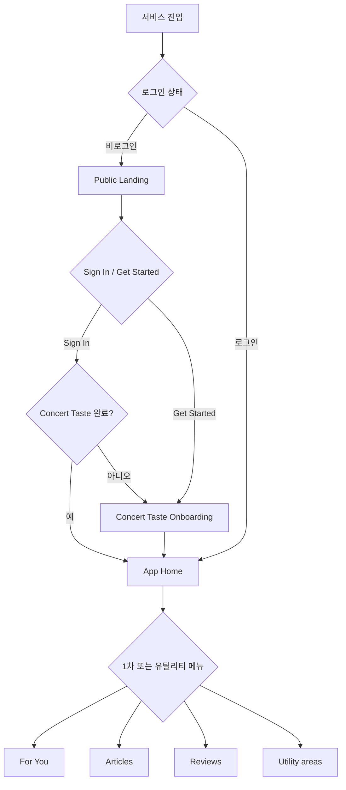

`App Home`에서는 세 1차 메뉴가 모두 비선택 상태다. 사용자가 1차 메뉴를 선택한 후 해당 메뉴만 활성 상태로 표시한다.

## 5. UF-01 서비스 진입 및 인증

### 목적

비로그인 사용자가 Resonance를 이해하고 Sign In 또는 Get Started 흐름으로 이동한다.

### 시작점

- 모바일 앱 또는 PWA 실행
- 데스크톱·태블릿 웹 주소 진입
- 로그아웃 상태에서 보호된 링크 진입

### 기본 흐름

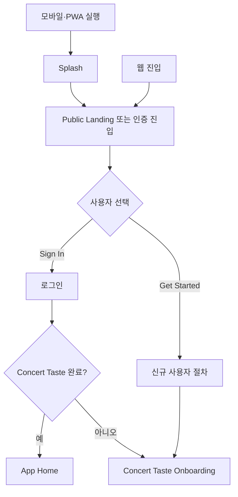

### 단계

| 단계 | 화면 | 사용자 행동 | 시스템 반응 |
| --- | --- | --- | --- |
| 1 | Splash | 앱 진입 | 브랜드 화면 표시 후 다음 단계로 전환 |
| 2 | Public Landing | 서비스 확인 | `Sign In`, `Get Started` 제공 |
| 3A | Sign In | 인증 정보 제출 | 성공 시 Concert Taste 완료 여부 확인 |
| 3B | Get Started | 신규 계정 절차 진행 | 인증 완료 후 `Concert Taste Onboarding` 이동 |

### 분기 및 예외

- 이미 로그인한 사용자는 공개 랜딩과 인증을 건너뛰고 `App Home`으로 이동한다.
- 인증 실패 시 입력을 보존하고 인증 화면에 머무르며 재시도 경로를 제공한다.
- 보호된 deep link로 진입한 비로그인 사용자의 인증 후 복귀 정책은 Open Question이다.
- Splash 이후 상태별 정확한 도착 화면은 Open Question이다.

### 완료 조건

- Concert Taste가 있는 사용자는 인증된 상태로 `App Home`에 도달한다.
- Concert Taste가 없는 사용자는 인증을 마치고 `Concert Taste Onboarding`에 도달한다.

## 6. UF-02 신규 사용자 Concert Taste 설정

### 목적

신규 사용자가 공연 및 좌석 추천에 필요한 최소 취향을 입력하고 App Home에 도달한다.

### 선행 조건

- 신규 사용자 계정 생성 또는 최초 인증이 완료되었다.

### 기본 흐름

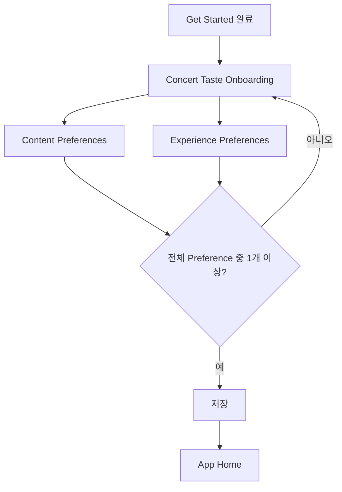

### 입력 영역

| 영역 | 의미 | 입력 방향 |
| --- | --- | --- |
| Content Preferences | 무엇을 보고 싶은가 | 작곡가·작품·연주자·지휘자·악기·공연 형식·키워드 |
| Experience Preferences | 공연장에서 어떻게 경험하고 싶은가 | 조건부 취향을 포함할 수 있는 자연어 |

### 규칙

- Skip을 제공하지 않는다.
- 두 영역을 모두 반드시 입력할 필요는 없지만 Preference 전체에서 최소 하나는 있어야 한다.
- Experience Preference의 자연어 원문을 보존한다.
- 외부 음악 서비스 연결 없이도 직접 입력만으로 완료할 수 있어야 한다.

### 분기 및 예외

- 입력이 하나도 없으면 완료할 수 없으며 현재 화면에서 입력을 안내한다.
- 저장 실패 시 입력값을 잃지 않고 재시도할 수 있어야 한다.
- AI 해석 결과의 확인·수정 단계를 필수로 둘지는 Open Question이다.
- Apple Music을 입력 보조로 제공할지는 Open Question이다.

### 완료 조건

- 최소 한 개의 Preference가 사용자 계정에 저장된다.
- 사용자가 중립 상태의 `App Home`에 도달한다.

## 7. UF-03 App Home에서 핵심·유틸리티 영역 진입

### 목적

로그인 사용자가 중립 홈에서 핵심 콘텐츠 또는 사용자 설정 영역으로 이동한다.

### 기본 흐름

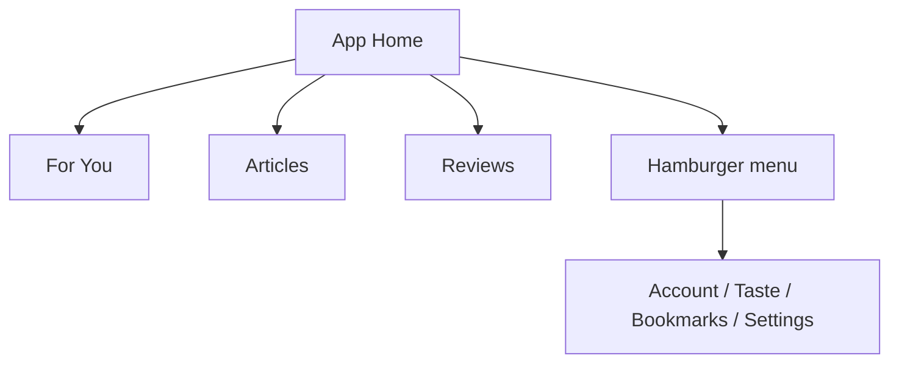

### 화면 내 행동

| 행동 | 결과 |
| --- | --- |
| `For You` 선택 | 개인화 공연 피드로 이동하고 `For You` 활성 표시 |
| `Articles` 선택 | 아티클 목록으로 이동하고 `Articles` 활성 표시 |
| `Reviews` 선택 | 내 후기 목록으로 이동하고 `Reviews` 활성 표시 |
| 햄버거 메뉴 선택 | Account, My Concert Taste, Bookmarks, Settings 진입점 표시 |

### 상태 규칙

- `App Home`에서는 세 1차 메뉴가 모두 비선택 상태다.
- LP는 기본 상태에서 노란 `resonance` 레이블을 표시한다.
- 재생 상태가 존재한다면 흑백 작곡가·연주자 이미지로 전환한다.

### 미확정 연결

- 로고 선택 시 App Home으로 돌아가는지
- LP가 실제 음악을 재생하는지, 시각적 상호작용만 제공하는지
- 전역 검색을 MVP에 포함하는지
- 기존 사용자 재로그인 시 항상 App Home으로 이동할지 마지막 화면을 복원할지

## 8. UF-04 My Concert Taste 조회 및 수정

### 목적

사용자가 명시적으로 입력한 콘텐츠 취향과 경험 취향을 확인하고 수정한다.

### 기본 흐름

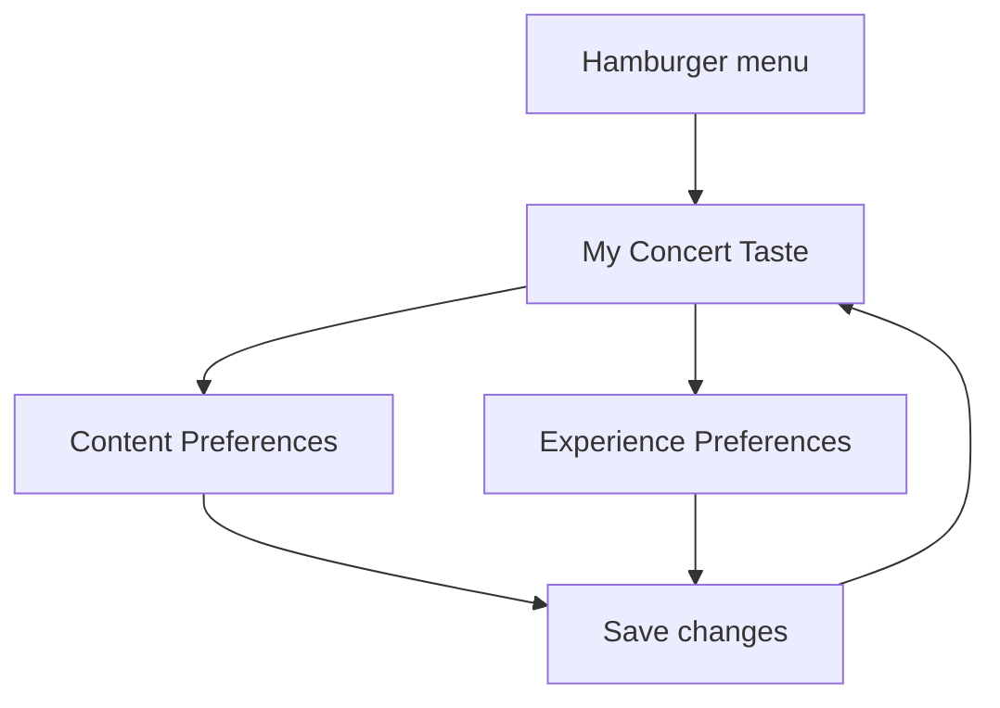

### 규칙

- Content Preferences와 Experience Preferences를 구분한다.
- Experience Preference의 자연어 원문을 조회·수정할 수 있다.
- 후기와 행동에서 추론한 `Learned Experience Signals`는 MVP에서 이 화면에 표시하지 않는다.
- 저장된 변경은 이후 공연·좌석 추천에 반영한다.

### 분기 및 예외

- 모든 Preference를 삭제하려 할 때 허용할지, 최소 한 개 규칙을 계속 적용할지는 Open Question이다.
- AI가 해석한 구조화 결과를 사용자에게 보여줄지는 Open Question이다.
- 저장 실패 시 수정 중인 값을 보존한다.

### 완료 조건

- 변경한 명시적 Preference가 저장되고 이후 추천 입력으로 사용된다.

## 9. UF-05 For You에서 관심 공연 발견

### 목적

사용자가 Concert Taste에 맞는 공연과 좌석 추천 요약을 확인하고 다음 행동으로 이동한다.

### 선행 조건

- 사용자가 로그인한 상태다.
- 최소 한 개의 Concert Taste Preference가 존재한다.

### 기본 흐름

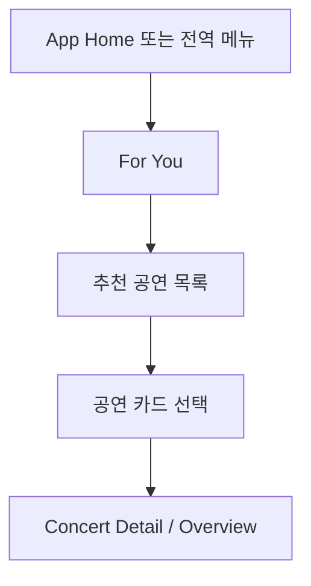

### 단계

| 단계 | 화면 | 사용자 행동 | 시스템 반응 |
| --- | --- | --- | --- |
| 1 | App Home 또는 다른 1차 영역 | `For You` 선택 | 개인화 추천 공연 피드 표시 |
| 2 | For You | 공연명·일시·장소·추천 좌석·이유 확인 | 공연별 추천 맥락 제공 |
| 3 | For You | 공연 카드 선택 | 해당 `Concert Detail > Overview` 이동 |

### 카드 내 직접 행동

| 행동 | 결과 |
| --- | --- |
| 좌석 추천 요약 선택 | `Concert Detail > Seat` 이동 |
| 공연 저장 | 저장 상태 반영, `Bookmarks > Concerts`에서 조회 가능 |
| `Book Tickets` / 예매하기 | 외부 공식 예매처 이동 |
| `Write Review` / 후기 남기기 | 해당 공연과 연결된 후기 작성 시작 |

`All Events` 컨트롤과 그에 따른 분기는 존재하지 않는다.

### 빈 상태

추천 공연이 없으면 빈 상태가 필요하다. My Concert Taste 수정, 나중에 다시 확인 또는 다른 탐색 행동 중 무엇을 우선 제공할지는 Open Question이다.

### 완료 조건

- 사용자가 공연 상세, 좌석 추천, Bookmarks, 외부 예매처 또는 후기 작성 중 하나의 다음 목표로 이동한다.

## 10. UF-06 알림에서 공연 상세 확인

### 목적

사용자가 Concert Taste와 일치해 도착한 공연 알림에서 해당 공연을 즉시 확인한다.

### 흐름

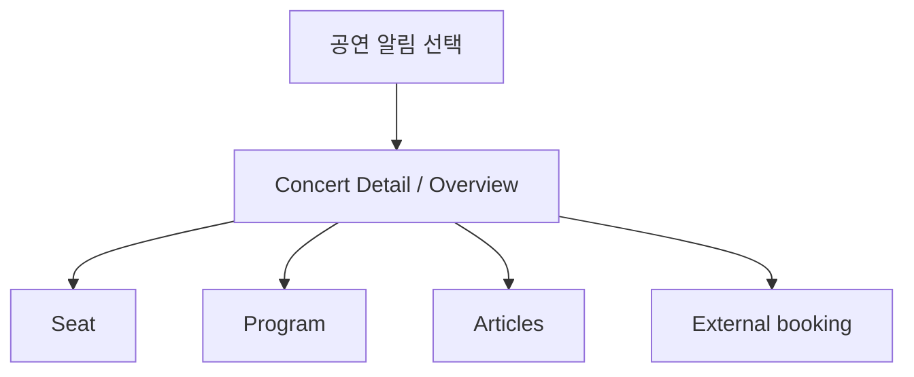

### 규칙

- 별도 `Alerts` 화면을 거치지 않는다.
- 알림은 해당 `Concert Detail`로 deep link한다.
- 알림에는 좌석 추천 요약을 포함한다.
- 실시간 잔여석을 확인하거나 구매 가능 좌석을 보장했다는 표현을 사용하지 않는다.

### 분기 및 예외

- 비로그인 상태의 알림 deep link 처리와 인증 후 복귀는 Open Question이다.
- 알림 읽음 상태와 전달 채널은 Open Question이다.
- 공연 취소·일시·출연자·프로그램 변경 알림 정책은 Open Question이다.

### 완료 조건

- 사용자가 알림 대상 공연의 상세를 확인하고 좌석·프로그램·아티클·예매로 이동할 수 있다.

## 11. UF-07 공연 상세 탐색

### 목적

사용자가 한 공연의 핵심 정보를 확인하고 좌석·프로그램·아티클·후기로 이동한다.

### 기본 흐름

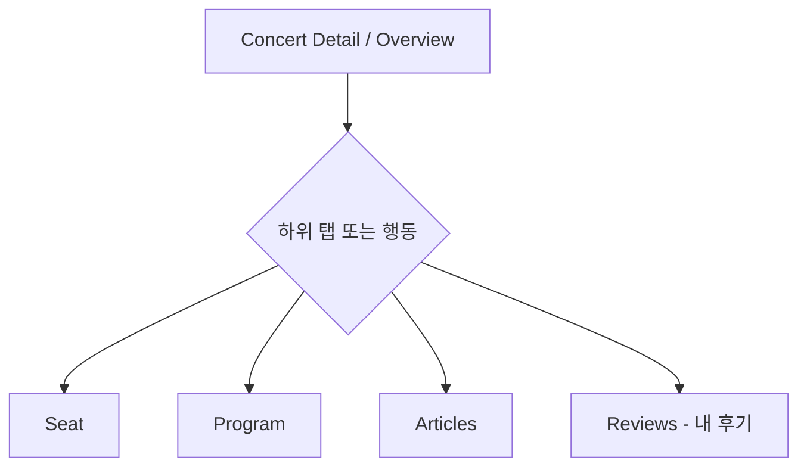

### Overview에서 가능한 행동

| 행동 | 결과 |
| --- | --- |
| 공연 정보 확인 | 일시·장소·출연자·프로그램 요약 표시 |
| 추천 좌석 요약 선택 | `Seat` 이동 |
| `Program` 선택 | 구조화된 프로그램 표시 |
| `Articles` 선택 | 해당 공연의 관련 아티클 목록 표시 |
| `Reviews` 선택 | 해당 공연의 내 후기 영역 표시 |
| 공연 저장 | `Bookmarks > Concerts`와 저장 상태 동기화 |
| `Book Tickets` | 외부 공식 예매처 이동 |
| `Write Review` | 해당 공연의 후기 작성 시작 |

### 내비게이션 결과

- 하위 탭 사이를 이동해도 동일한 공연 맥락을 유지한다.
- 타인의 후기 화면으로 연결되는 분기는 존재하지 않는다.
- 상세 화면의 상위 1차 메뉴 활성 상태와 뒤로가기 복귀 위치는 Open Question이다.

### 완료 조건

- 사용자가 공연 맥락을 유지한 채 원하는 하위 정보 또는 다음 행동으로 이동한다.

## 12. UF-08 개인화 좌석 추천 확인 및 기준 조정

### 목적

사용자가 해당 공연에서 자신에게 적합한 좌석 번호 또는 범위와 추천 이유를 확인하고 필요하면 이번 추천 기준을 조정한다.

### 시작점

- `For You`의 좌석 추천 요약
- `Concert Detail > Overview`의 좌석 추천 요약
- `Concert Detail > Seat`
- 공연 알림에서 진입한 `Concert Detail`

### 기본 흐름

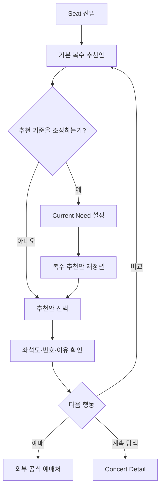

### 기본 추천 생성

- 추천 진입 전에 추가 질문을 강제하지 않는다.
- Concert Taste, Learned Experience Signals, 공연·프로그램·출연자, 공연장·좌석도 맥락을 사용한다.
- 가능한 경우 실제 관객 후기에서 구조화한 좌석 경험 근거를 사용한다.
- 작품 중심·연주자 중심 등 공연 선택 맥락에 따라 우선순위가 달라질 수 있다.

### 사용자가 확인하는 정보

- 추천안 이름 — 공연 상황에 따라 생성
- 좌석 번호 또는 좌석 번호 범위
- 공연장 배치도에서 강조된 위치
- 추천 이유와 반영한 취향·공연 맥락
- 후기 근거를 사용한 경우 근거 유형
- 실시간 구매 가능 여부를 확인하지 않았다는 안내

### 복수 추천안 규칙

- 하나의 절대적 최적 좌석만 제시하지 않는다.
- 추천안 수를 고정하지 않는다.
- `Best value`, `Center view`, `Immersive`는 고정 유형이 아니다.
- 사용자는 추천안을 선택해 상세 이유를 보고 다른 안과 비교할 수 있다.

### Current Need 조정

- 사용자가 필요할 때만 `추천 기준 조정`을 연다.
- 변경한 Current Need는 해당 공연의 현재 추천에 우선 적용한다.
- Current Need가 장기 Concert Taste를 자동으로 덮어쓰지 않는다.

### 예외 상태

- 추천 생성 중: 로딩 상태 표시
- 추천 생성 실패: 작성 중인 맥락을 유지하고 재시도 또는 공연 상세 복귀 제공
- 근거 부족: 부족한 데이터와 추천 한계를 표시하고 대체 행동 제공
- 좌석도 미지원: 지원 범위와 가능한 대안 안내

구체적인 실패 후속 행동과 confidence 노출 수준은 Open Question이다.

### 완료 조건

- 사용자가 적어도 하나의 추천 위치와 이유를 확인한다.
- 필요하면 Current Need를 조정하거나 외부 예매처로 이동한다.

## 13. UF-09 프로그램 확인

### 목적

사용자가 공연의 작곡가, 작품, 악장, 연주 순서와 휴식을 확인한다.

### 흐름

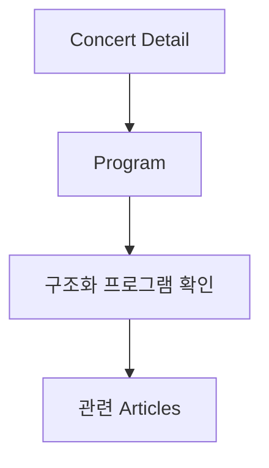

### 규칙

- 원천 자료에서 확인 가능한 정보만 표시한다.
- 일부 악장만 연주되는 경우 전체 작품과 실제 연주 범위를 구분한다.
- 프로그램과 관련 아티클의 연결을 유지한다.

### 예외 상태

- 일부 정보만 확인된 경우 확인된 정보와 없는 정보를 구분한다.
- 프로그램 변경이 감지된 경우 최신 상태와 변경 사실을 표시하는 방식이 필요하다.

프로그램에서 아티클로 연결되는 정확한 UI와 변경 표시 방식은 Open Question이다.

### 완료 조건

- 사용자가 확인 가능한 프로그램 구조를 이해하고 필요하면 관련 아티클로 이동한다.

## 14. UF-10 아티클 탐색·읽기·저장

### 목적

사용자가 공연 전 감상을 돕는 아티클을 발견하고 본문·출처를 확인하며 나중에 읽기 위해 저장한다.

### 진입 경로 A: 전역 Articles

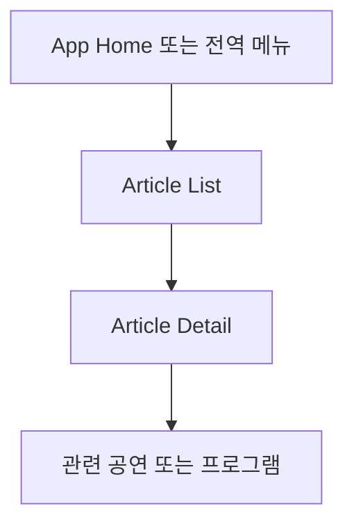

### 진입 경로 B: 공연 상세

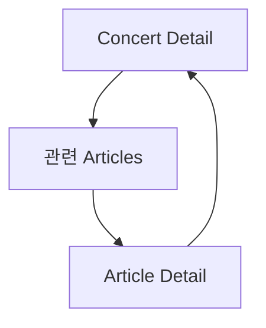

### 단계

| 단계 | 화면 | 사용자 행동 | 시스템 반응 |
| --- | --- | --- | --- |
| 1 | Article List 또는 Concert Detail > Articles | 아티클 선택 | `Article Detail` 표시 |
| 2 | Article Detail | 제목·본문 읽기 | 전체 콘텐츠와 출처 제공 |
| 3 | Article Detail | 원문 또는 관련 맥락 확인 | 출처·관련 공연·프로그램 연결 |
| 4 | Article Detail | Bookmark 선택 | 저장 상태 반영 및 `Bookmarks > Articles`에 추가 |

### 분기 및 예외

- 저장 해제 시 `Bookmarks > Articles`와 현재 화면의 상태를 동기화한다.
- 원문으로 이동할 때 앱 밖으로 이동한다는 상태를 알린다.
- 관련 공연으로 이동한 뒤 읽던 위치를 보존할지는 Open Question이다.
- 목록 분류·검색·정렬과 `전체 글 보기` 표현은 Open Question이다.

### 완료 조건

- 사용자가 본문과 출처를 확인한다.
- 필요하면 아티클을 저장하거나 관련 공연·프로그램으로 이동한다.

## 15. UF-11 Bookmarks에서 저장 콘텐츠 재열람

### 목적

사용자가 저장한 공연과 아티클을 분리해 조회하고 원래 상세 화면으로 돌아간다.

### 기본 흐름

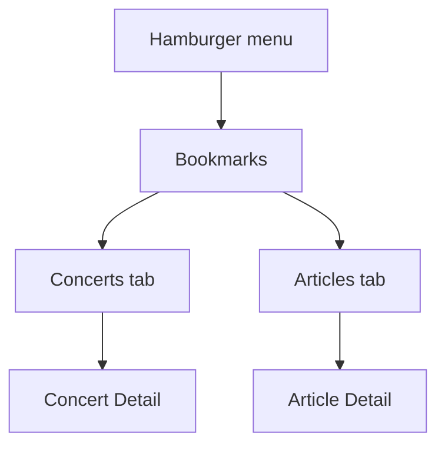

### Concerts 탭

| 행동 | 결과 |
| --- | --- |
| 저장한 공연 선택 | 해당 `Concert Detail` 이동 |
| 저장 해제 | 목록과 공연 카드·상세의 상태 동기화 |

### Articles 탭

| 행동 | 결과 |
| --- | --- |
| 저장한 아티클 선택 | 해당 `Article Detail` 이동 |
| 저장 해제 | 목록과 Article Detail의 상태 동기화 |

### 추천 신호

- 공연 Bookmark는 약한 Concert Taste 행동 신호로 기록한다.
- 명시적 Preference나 Review와 같은 강도의 신호로 취급하지 않는다.
- Article Bookmark를 추천 신호로 사용할지는 Open Question이다.

### 빈 상태

- Concerts와 Articles 탭은 각각 독립된 빈 상태를 가진다.
- 각 빈 상태에서 For You 또는 Articles로 연결할지와 문구는 Open Question이다.

### 완료 조건

- 사용자가 저장한 공연 또는 아티클을 재열람하거나 저장을 해제한다.

## 16. UF-12 후기 작성

### 목적

사용자가 특정 공연의 관람 경험과 선택적인 좌석 경험을 구조화된 평가와 자유 텍스트로 기록한다.

### 시작점

- `For You` 공연 카드의 `Write Review`
- `Concert Detail > Overview`의 `Write Review`
- `Concert Detail > Reviews`
- 전역 `Reviews`의 작성 진입점이 제공되는 경우 해당 진입점

### 기본 흐름

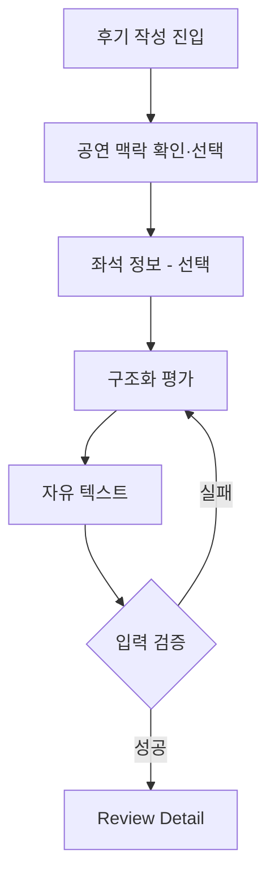

### 공연 연결

- 공연 화면에서 진입하면 해당 공연을 미리 연결한다.
- 전역 Reviews에서 직접 작성할 경우 공연 검색·선택 흐름이 필요할 수 있으나 MVP 포함 여부는 Open Question이다.

### 좌석 정보

- 구역, 열, 좌석 번호는 선택 입력이다.
- 좌석 정보를 입력하지 않았다는 이유만으로 후기 전체 저장을 막지 않는다.
- 입력 편의 방식으로 직접 입력, 좌석도 선택, 이전 Resonance 추천 불러오기가 후보지만 MVP 방식은 Open Question이다.

### MVP 잠정 평가 항목

| 영역 | 항목 | 형식 |
| --- | --- | --- |
| 공연 | 공연 전체 만족도 | 1–5 |
| 공연 | 연주 | 1–5 |
| 공연 | 프로그램 | 1–5 |
| 좌석 경험 | 좌석 시야 | 1–5 |
| 좌석 경험 | 좌석 음향 | 1–5 |
| 좌석 경험 | 몰입감 | 1–5 |
| 서술 | 자유 텍스트 | 장문 입력 |

평가 항목과 전 항목 5점 척도는 MVP 잠정이다. 좌석 정보가 없을 때 좌석 경험 평가를 숨길지 선택 입력으로 남길지는 Open Question이다.

### 저장 성공 후

- 저장된 `Review Detail`로 이동한다.
- 전역 Reviews와 `Concert Detail > Reviews`에 동일한 기록을 반영한다.
- 좌석 정보와 좌석 경험 평가가 있으면 향후 추천을 위한 `Learned Experience Signals`의 입력이 될 수 있다.
- Learned Experience Signals 갱신은 사용자에게 별도 설정 화면으로 나타나지 않으며 후기 저장을 막지 않는다.

### 분기 및 예외

- 저장 실패 시 작성 내용을 잃지 않고 오류와 재시도 경로를 제공한다.
- 최소 필수 필드, 임시 저장, 작성 취소 확인은 Open Question이다.
- 후기 작성 가능 시점과 실제 관람 확인 정책은 Open Question이다.
- 공연 전 기대 곡·사전 감상 메모는 MVP에서 제외한다.

### 완료 조건

- 후기가 사용자 계정과 해당 공연에 연결되어 저장된다.
- 저장된 후기를 Reviews와 Concert Detail에서 다시 찾을 수 있다.

## 17. UF-13 후기 조회 및 수정

### 목적

사용자가 자신의 과거 후기를 찾아 읽고 필요한 경우 수정한다.

### 기본 흐름

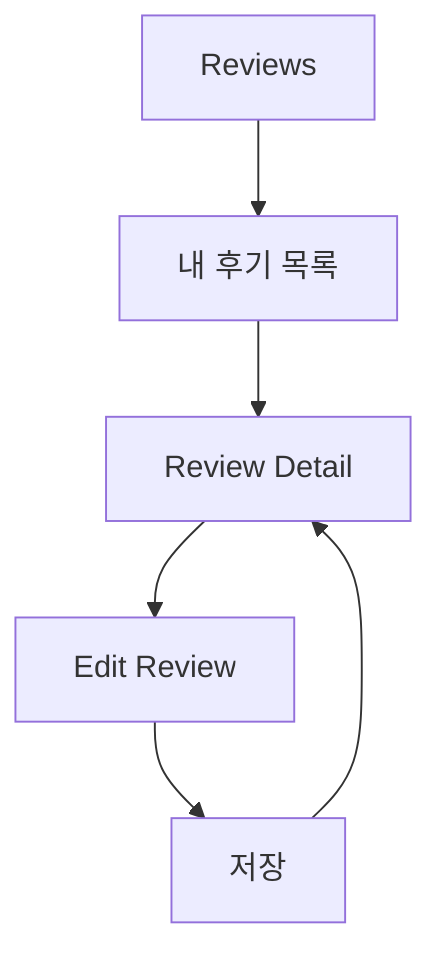

### 대체 진입

- `Concert Detail > Reviews`
- 후기 저장 직후의 `Review Detail`

### 단계

| 단계 | 화면 | 사용자 행동 | 시스템 반응 |
| --- | --- | --- | --- |
| 1 | Reviews | 내 후기 선택 | 후기 상세 표시 |
| 2 | Review Detail | 수정 선택 | 기존 값이 채워진 편집 화면 표시 |
| 3 | Edit Review | 내용 변경 후 저장 | 갱신된 후기 상세 표시 |

### 규칙과 예외

- 사용자는 자신의 후기만 조회·수정할 수 있다.
- 좌석 정보를 제거해도 허용할지와 기존 Learned Experience Signals의 재계산 정책은 기능·데이터 명세에서 결정한다.
- 저장 실패 시 수정 중인 내용을 보존한다.

### 빈 상태

작성한 후기가 없으면 개인 후기 빈 상태를 표시한다. For You, 공연 선택 또는 작성으로 연결할지는 Open Question이다.

### 완료 조건

- 사용자가 자신의 후기를 조회하거나 변경 내용을 동일한 기록에 저장한다.

## 18. UF-14 후기 삭제

### 목적

사용자가 자신이 작성한 후기를 실수 방지 확인 후 삭제한다.

### 흐름

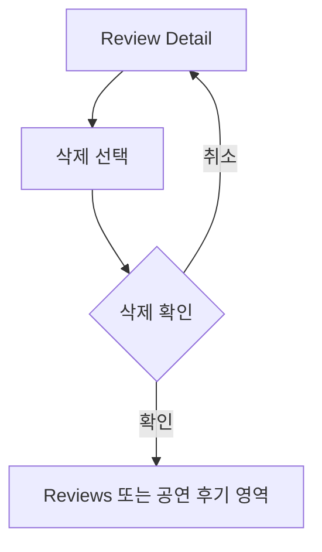

### 규칙

- 사용자는 자신의 후기만 삭제할 수 있다.
- 확인 전에는 삭제를 실행하지 않는다.
- 삭제 결과를 전역 Reviews와 해당 `Concert Detail > Reviews`에 일관되게 반영한다.
- 관련 Learned Experience Signals의 삭제·재계산 정책은 데이터 명세에서 정의한다.

### 미확정 사항

- 삭제 복구 제공 여부
- 삭제 완료 후 전역 Reviews와 공연 후기 영역 중 정확한 도착점

### 완료 조건

- 삭제한 후기가 개인 후기 목록과 해당 공연의 후기 영역에 나타나지 않는다.

## 19. UF-15 재관람과 여러 후기

### 목적

사용자가 같은 공연 또는 같은 작품을 다른 날짜·좌석에서 본 경험을 서로 다른 기록으로 남긴다.

### 확정 방향

- 한 공연과 관련된 여러 개인 기록을 허용한다.
- 각 기록은 다른 관람일이나 좌석 경험을 가질 수 있다.

### 후보 흐름

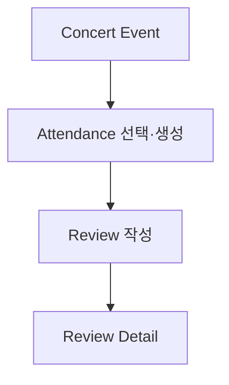

`Attendance 1 : Review 1` 모델의 최종 채택, Attendance 생성 방식, 동일 관람에 여러 Review를 허용할지는 Open Question이다. 확정 전까지 화면에 불필요한 별도 Attendance 관리 기능을 만들지 않는다.

## 20. UF-16 외부 예매 이동과 복귀

### 목적

사용자가 추천을 확인한 뒤 외부 공식 예매처에서 티켓 구매를 진행한다.

### 시작점

- `For You`의 `Book Tickets`
- `Concert Detail > Overview`의 예매하기
- `Concert Detail > Seat`의 예매하기

### 흐름

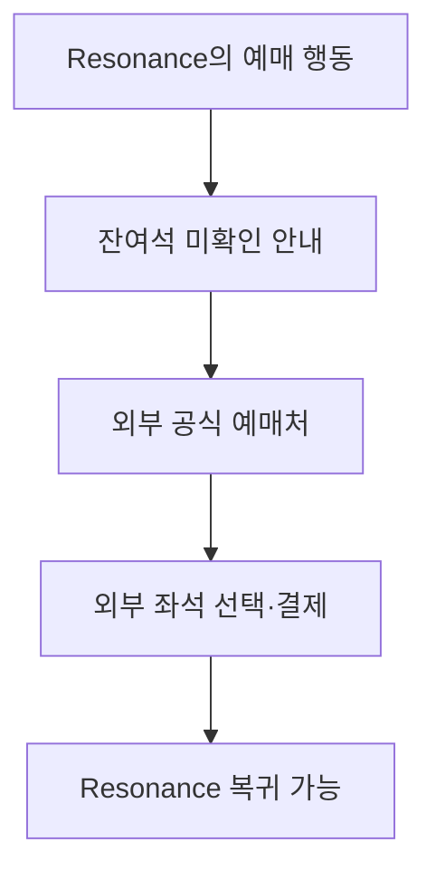

### 경계

- 좌석 재고 확인, 좌석 선택, 결제, 예매 완료는 외부 예매처의 책임이다.
- Resonance 추천 좌석의 현재 구매 가능 여부를 보장하지 않는다.
- 추천 좌석을 판매 중인 좌석처럼 표시하지 않는다.

### 미확정 사항

- 외부 예매처에서 돌아왔을 때 원래 공연과 탭·선택 추천안을 복원하는지
- 실제 예매 완료 여부를 사용자 행동 신호로 확인하는 방법

### 완료 조건

- 사용자가 Resonance의 경계를 이해한 상태로 공식 예매처에 도달한다.

## 21. UF-17 LP 상태 전환 — 조건부 흐름

### 목적

Splash와 App Home의 LP를 하나의 일관된 브랜드 상태 시스템으로 연결한다.

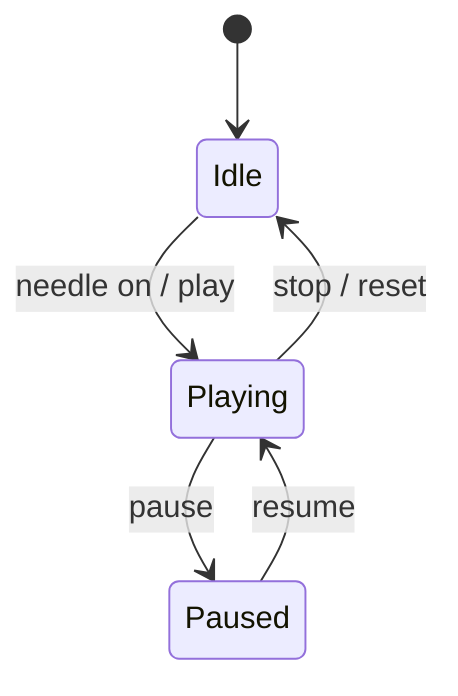

### 확정된 시각 방향

- Idle: 노란 `resonance` 레이블
- Playing: 흑백 작곡가·연주자 이미지와 LP 회전

### 경계

- 실제 음원 재생 기능의 MVP 포함 여부는 Open Question이다.
- 실제 재생을 포함하지 않는 프로토타입에서는 시각 상태 전환만 검증할 수 있다.
- Paused와 Error의 정확한 시각 표현은 디자인 명세에서 확정한다.

이 흐름은 음악 재생 기능이 확정되기 전까지 핵심 MVP 완료 조건에 포함하지 않는다.

## 22. UF-18 전역 메뉴 전환 및 유틸리티 진입

로그인 상태에서는 핵심 화면에서 세 전역 1차 메뉴와 햄버거 메뉴에 접근할 수 있어야 한다.

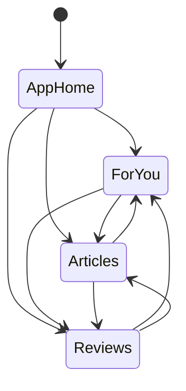

### 유틸리티 이동

햄버거 메뉴는 `Account`, `My Concert Taste`, `Bookmarks`, `Settings`로 연결한다. 유틸리티 화면에서 원래 핵심 화면으로 돌아갈 때 이전 맥락을 유지할지는 Navigation Rules에서 확정한다.

### 상태 규칙

- `App Home`: 모든 1차 메뉴 비선택
- `For You`: `For You`만 선택
- `Articles`: `Articles`만 선택
- `Reviews`: `Reviews`만 선택
- `Concert Detail`: 진입 경로에 따른 상위 메뉴 활성 상태는 Open Question
- `Article Detail`: 전역 Articles 또는 Concert Detail 중 진입 경로에 따른 활성 상태는 Open Question
- `Review Detail`: 전역 Reviews 또는 Concert Detail 중 진입 경로에 따른 활성 상태는 Open Question

## 23. 공통 상태 요구사항

아래 상태는 각 기능에 필요하지만 정확한 시각 표현과 문구는 Interaction States에서 정의한다.

| 상태 | 적용 화면 | 필요한 사용자 경로 |
| --- | --- | --- |
| Loading | 인증, For You, Concert Detail, Seat, Articles, Reviews, Bookmarks | 작업 진행 상태 인지 |
| Empty | 추천 공연, 관련 아티클, 내 후기, Bookmarks 각 탭 | 가능한 다음 행동 확인 |
| Error | 인증, 데이터 조회, 추천 생성, 저장·수정·삭제 | 재시도 또는 안전한 이전 화면 이동 |
| Partial data | Program, Concert Detail, Seat | 확인된 정보와 없는 정보 구분 |
| Unsaved changes | Taste, Review 작성·수정 | 이탈 전 입력 손실 방지 |
| External transition | 예매처, 아티클 원문 | 앱 밖으로 이동함을 인지 |
| Unsupported | 미지원 좌석도·공연장 | 지원 범위와 대체 행동 확인 |

## 24. 반응형 흐름 원칙

- 모바일·태블릿·PC에서 목표와 단계 순서는 동일하다.
- 모바일에서는 상단 가로 메뉴를 통해 세 1차 영역을 전환한다.
- 데스크톱에서는 좌측 사이드 메뉴를 통해 동일한 영역을 전환한다.
- 태블릿 내비게이션은 Open Question이다.
- 화면 크기가 변해도 현재 사용자, 선택한 공연, 선택한 추천안, 읽던 아티클, 작성 중인 후기 맥락이 임의로 바뀌지 않아야 한다.
- breakpoint, 내비게이션 고정, 스크롤 위치 보존과 상세 화면의 내비게이션 유지 범위는 별도 Responsive·Navigation Rules에서 확정한다.

## 25. 범위에서 제외된 사용자 흐름

### MVP 제외

- 실시간 잔여 좌석을 확인하고 그중 최적 좌석을 계산하는 흐름
- Resonance 안에서 좌석을 선택하고 결제하는 흐름
- 공연 전 기대 곡·사전 감상 메모 작성 흐름
- Learned Experience Signals를 Dashboard에서 직접 관리하는 흐름

### 폐기

- 별도 `Alerts` 메뉴 또는 알림 목록 탐색
- `All Events` 필터 사용
- 타인의 후기 탐색·저장·삭제
- 댓글, 좋아요, 팔로우 등 사용자 간 커뮤니티
- YouTube 영상 임베딩 또는 YouTube·YouTube Music 데이터 연결
- 모바일과 PC·태블릿을 서로 다른 정보 구조의 앱으로 이동하는 흐름

## 26. Open Questions

### 인증과 초기 설정

1. Splash 이후 상태별 정확한 도착 화면은 어디인가?
2. 인증 방식과 신규 사용자 가입 단계는 무엇인가?
3. 보호된 deep link의 인증 후 원래 화면 복귀를 지원하는가?
4. 기존 사용자 재로그인 시 App Home과 마지막 화면 중 어디로 이동하는가? UF-01·D-003과의 관계는 [결정 로그](../decisions/DECISION_LOG_AND_OPEN_QUESTIONS.md)의 DR-002 참조.
5. Concert Taste 수정 후에도 최소 한 개 Preference 규칙을 유지하는가?
6. Experience Preference의 AI 해석 확인 단계를 필수로 두는가?
7. Apple Music 입력 보조를 MVP에 포함하는가?

### App Home과 전역 이동

8. 로고 선택 시 App Home으로 이동하는가?
9. LP는 실제 음악을 재생하는가, 시각적 상호작용만 제공하는가?
10. 실제 재생을 한다면 어떤 제공자와 연결하는가?
11. 전역 검색을 MVP에 포함하는가?
12. 상세·유틸리티 화면에서 active 메뉴와 뒤로가기 맥락을 어떻게 유지하는가?

### For You와 알림

13. 추천 공연이 없을 때 My Concert Taste, 다른 탐색, 재확인 중 무엇을 우선 제공하는가?
14. For You의 정렬, 신규 표시, 이미 본 공연 처리 기준은 무엇인가?
15. 실제 MVP 알림 전달 채널은 무엇인가?
16. 알림 읽음 상태를 보존하는가?
17. 공연 취소·일시·출연자·프로그램 변경 알림을 어떻게 처리하는가?

### 좌석 추천과 예매

18. 추천 생성 실패·근거 부족·미지원 홀에서 어떤 대체 행동을 제공하는가?
19. 추천 score, confidence 및 후기 근거를 어느 수준까지 노출하는가?
20. 좌석도의 확대·이동·추천안 비교 interaction은 무엇인가?
21. 외부 예매처에서 돌아오면 원래 공연·탭·추천안 상태를 복원하는가?
22. 실제 예매 완료 여부를 사용자 행동 신호로 확인하는가?

### Articles와 Bookmarks

23. Article List의 분류·검색·정렬은 무엇인가?
24. `전체 글 보기`는 현재 화면 확장인가, 별도 화면 이동인가?
25. 관련 공연으로 이동했다 돌아왔을 때 읽던 위치를 보존하는가?
26. Article Bookmark를 추천 신호로 사용하는가?
27. Bookmarks 빈 상태에서 어떤 탐색 행동으로 연결하는가?
28. 저장 해제 후 과거 행동 신호를 얼마나 보존하는가?

### Reviews

29. 여섯 평가 항목과 전 항목 5점 척도를 최종 확정하는가?
30. 좌석 정보가 없을 때 좌석 경험 평가를 숨기는가, 선택 입력으로 두는가?
31. 좌석 직접 입력·좌석도 선택·추천 불러오기 중 어떤 방식을 MVP에 포함하는가?
32. `Attendance 1 : Review 1` 모델을 채택하는가?
33. Review의 최소 필수 필드와 검증 규칙은 무엇인가?
34. 임시 저장과 작성 취소 확인을 제공하는가? 공통 Unsaved changes 요구와의 관계는 [결정 로그](../decisions/DECISION_LOG_AND_OPEN_QUESTIONS.md)의 DR-004 참조.
35. 후기 작성 가능 시점과 실제 관람 확인 절차가 필요한가?
36. 후기 삭제를 복구할 수 있는가?
37. 저장·수정·삭제 완료 후 정확한 도착 화면은 어디인가? UF-12·UF-13 본문과의 관계는 [결정 로그](../decisions/DECISION_LOG_AND_OPEN_QUESTIONS.md)의 DR-003 참조.
38. 후기 목록의 검색·정렬·필터는 무엇인가?

### 반응형·접근성

39. 모바일·태블릿·데스크톱 breakpoint는 무엇인가?
40. 태블릿 전역 내비게이션은 어떤 형식인가?
41. 데스크톱 좌측 내비게이션은 어떤 인증·상세 화면에서 유지되는가?
42. 모바일 가로 메뉴와 햄버거 메뉴의 고정·스크롤 동작은 무엇인가?
43. 좌석도·평점·LP interaction의 키보드 및 screen reader 조작은 무엇인가?

## 27. IA 추적표

| IA 영역 | 관련 User Flow |
| --- | --- |
| Splash / Public Landing / Authentication | UF-01 |
| Concert Taste Onboarding | UF-02 |
| App Home | UF-03 |
| My Concert Taste | UF-04 |
| For You | UF-05 |
| 공연 알림 | UF-06 |
| Concert Detail | UF-07 |
| Seat | UF-08 |
| Program | UF-09 |
| Articles / Article Detail | UF-10 |
| Bookmarks | UF-11 |
| Write / Edit Review | UF-12, UF-13 |
| Review Detail / Delete | UF-13, UF-14 |
| 여러 후기·재관람 | UF-15 |
| 외부 예매처 | UF-16 |
| App Home LP | UF-17 |
| 전역·유틸리티 내비게이션 | UF-03, UF-04, UF-11, UF-18 |

## 28. v0.2 변경 기록

| 변경 | 반영 결과 |
| --- | --- |
| Concert Taste 필수 온보딩 | UF-02 추가, Get Started와 App Home 사이에 배치 |
| My Concert Taste | UF-04 추가 |
| 햄버거 유틸리티 메뉴 | UF-03과 전역 이동에 Account / Taste / Bookmarks / Settings 반영 |
| All Events 제거 | For You의 행동과 Open Questions에서 삭제 |
| 알림 도착점 확정 | UF-06을 `Concert Detail` 직행으로 수정 |
| 좌석 번호 수준 추천 | UF-08의 결과 단위를 좌석 번호·범위로 수정 |
| 상황별 복수 추천 | UF-08 기본 흐름으로 승격, 개수·명칭 비고정 |
| Current Need | 기본 추천 후 선택적 기준 조정 흐름 추가 |
| 실시간 잔여석 제외 | UF-08·UF-16에 구매 가능 여부 경계 추가 |
| Bookmarks 확정 | UF-10 저장 행동 및 UF-11 추가 |
| Review 구조 구체화 | UF-12에 구조화 평가·자유 텍스트·선택 좌석 반영 |
| 여러 후기 방향 | UF-15 추가, Attendance 모델은 Open Question 유지 |
| 공연 전 메모 | 제외 흐름으로 이동 |
| Learned Experience Signals | 후기 저장 후 비가시적 피드백 효과 반영 |
| LP 상태 방향 | 조건부 UF-17 추가 |
| YouTube 활용 폐기 | 제외 흐름에 반영 |

이 문서는 기존 `user-flow.md` v0.1의 확정 흐름과 `05_USER_FLOW_ADDENDUM.md`의 최신 결정을 [IA.md](IA.md) v0.3 기준으로 통합한 현행 User Flow다.
