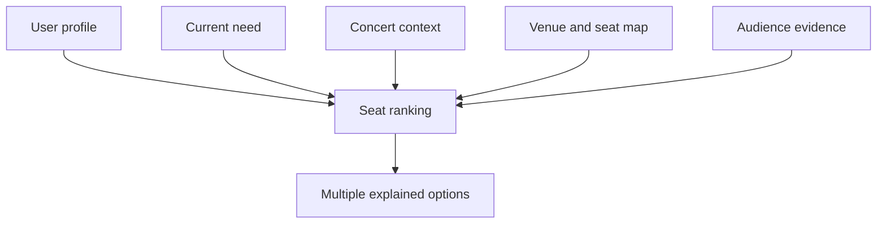
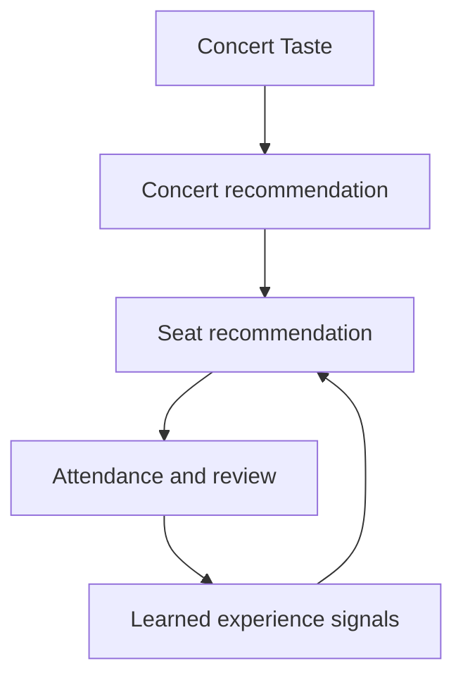

# Resonance — Recommendation System Specification

> 상태: Working baseline v1.0  
> 기준일: 2026-09-14

## 1. 추천 시스템의 역할

Resonance에는 서로 연결되지만 구분되는 두 추천 문제가 있다.

1. **Concert Recommendation**: 사용자가 어떤 공연을 보고 싶어 하는가?
2. **Seat Recommendation**: 그 공연에서 사용자가 어떤 좌석 경험을 원하며 어떤 좌석이 그 요구에 맞는가?

LLM은 비정형 텍스트에서 신호를 추출하고 설명을 생성할 수 있지만, 최종 추천은 근거 데이터와 명시된 가중치·규칙을 추적할 수 있어야 한다.

## 2. 사용자 신호 모델

| 계층 | 의미 | 예시 | 기본 신뢰도 |
| --- | --- | --- | --- |
| Explicit Content Preferences | 직접 입력한 공연 콘텐츠 취향 | Piazzolla, violin, chamber music | 높음 |
| Explicit Experience Preferences | 자연어로 직접 입력한 현장 경험 취향 | 가까운 연주 관찰, 오케스트라 밸런스 | 높음 |
| Learned Experience Signals | 후기·선택 행동에서 관찰한 경향 | 앞열에서 몰입감 평점이 반복적으로 높음 | 데이터량에 따라 증가 |
| Current Need | 이번 공연에 한해 적용하는 일시적 요구 | 오늘은 전체 음향 밸런스 우선 | 최우선 override |
| Weak Behavioral Signals | 해석이 여러 가지일 수 있는 행동 | 공연 북마크, 상세 반복 열람 | 낮음~중간 |

`Explicit Experience Preferences`와 `Learned Experience Signals`를 같은 필드에 덮어쓰지 않는다. 사용자가 말한 취향과 시스템이 관찰한 경향은 출처와 갱신 규칙이 다르다.

## 3. 공연 추천

### 3.1 입력

- 작곡가·작품
- 연주자·지휘자
- 악기·앙상블·공연 형식
- 해석 스타일에 관한 직접 입력
- 북마크, 상세 조회, 예매처 이동, 후기 등 first-party 행동
- 공연의 일시·장소·프로그램·출연자

YouTube 및 YouTube Music 데이터는 사용하지 않는다.

### 3.2 동일 작품의 연주 해석 선호

같은 곡이라도 연주자와 해석에 따라 선호가 달라질 수 있다는 문제를 보존한다. 이를 위해 작품 선호와 연주자 선호를 분리하고, 사용자가 해석 스타일을 자연어로 표현할 수 있게 한다.

외부 영상 재생·시청 데이터를 우회 수집하지 않는다. 북마크, 공연 상세 탐색, 직접 선택, 후기와 같은 first-party 신호를 이용한다.

## 4. 좌석 추천 입력

### 4.1 User profile

- Explicit Experience Preferences
- Learned Experience Signals
- 과거 선택 좌석과 후기 평점

### 4.2 Concert context

- 공연 형식: 독주, 실내악, 협주곡, 오케스트라 등
- 프로그램과 중심 작품
- 연주자·지휘자와 주요 악기
- 무대 위 배치와 협연자 위치
- 공연별 무대 확장, 합창석 개방, 미판매 열 등 변형

### 4.3 Venue and seat map

- 홀, 층, 구역, 열, 좌석 번호
- 무대와의 거리
- 중앙선과의 거리
- 좌우 위치와 시야 특성
- 알려진 음향·시야 제약

### 4.4 Audience evidence

좌석 추천은 추상적인 음향학 추론만으로 만들지 않고 실제 관객 후기를 우선 근거로 삼는 방향이다. 후기는 좌석·구역과 다음 aspect를 연결해 구조화한다.

- 시야
- 음향
- 몰입감
- 근접감·연주 관찰
- 가격 대비 만족도 — Later 또는 추가 검토
- 공연 형식·편성에 따른 조건

외부 후기의 수집 출처, 이용 허용 범위, 중복 제거 및 신뢰도 기준은 Open Question이다.

## 5. 추천 경로에 따른 목적 가중치

사용자가 무엇을 중심으로 공연을 선택했는지에 따라 좌석 추천의 우선순위를 달리할 수 있다.

| 추천 맥락 | 상대적으로 중시할 좌석 경험 |
| --- | --- |
| 작품·곡 중심 | 앙상블 균형, 공간감, 전체 음향, 프로그램 전체의 일관된 감상 |
| 연주자 중심 | 연주자 가시성, 근접감, 움직임·주법 관찰, 직접적인 소리 |
| 명시적 Current Need | 위 기본값보다 우선하는 이번 공연의 요구 |

이 표는 고정 점수가 아니라 추천 의도를 결정하는 기준이다. 정확한 가중치는 데이터 검증 후 확정한다.

## 6. 복수 추천안 — 확정

- 하나의 절대적 최적 좌석만 제시하지 않는다.
- 공연, 공연장, 프로그램, Concert Taste, Current Need와 유효한 좌석 구조에 따라 복수의 답안을 제시한다.
- 추천안 수는 고정하지 않는다.
- UX상 2~4개가 권장 범위지만 확정 규칙은 아니다.
- `Best value`, `Center view`, `Immersive`는 목업 예시일 뿐 고정 도메인 유형이 아니다.
- 추천안 이름과 설명은 해당 공연의 실제 trade-off를 반영한다.

예: 피아졸라 퀸텟에서는 `연주자 몰입`, `앙상블 균형`, `홀 블렌딩`처럼 구성할 수 있다.

## 7. Current Need 조정 — 확정

좌석 탭에 진입할 때마다 사용자가 질문에 답하도록 강제하지 않는다.

1. Concert Taste, 학습 신호, 공연 맥락으로 기본 복수 추천안을 자동 생성한다.
2. 사용자는 필요할 때만 `추천 기준 조정`을 연다.
3. 변경한 Current Need는 해당 공연·추천 세션에 우선 적용한다.
4. Current Need가 장기 Concert Taste를 자동으로 덮어쓰지 않는다.

## 8. 추천 결과 단위 — 확정

좌석 추천의 최종 단위는 개별 좌석 번호까지 지원하는 것을 원칙으로 한다.

표현 예:

- `1층 B블록 7열 11–14번`
- `1층 B블록 8열 10–15번`

추천 범위 안에서 특정 좌석이 현재 판매 가능한지는 별도 문제다.

## 9. 실시간 잔여석과 외부 예매 — 확정

- MVP는 실시간 잔여석과 연동하지 않는다.
- 추천 좌석의 현재 구매 가능 여부를 보장하지 않는다.
- 예매, 좌석 선택, 결제, 예매 완료는 공식 외부 예매처가 담당한다.
- UI는 `Availability is not checked`와 동등한 한국어 안내를 명확히 제공해야 한다.
- 장기적으로 공식 API 또는 파트너 연동이 가능한 경우, 구매 가능한 좌석 중 최고 점수를 계산하는 기능을 별도 설계한다.

## 10. 후기 기반 피드백 루프

좌석 정보가 있는 Review에서 다음 조합이 핵심 피드백이 된다.

`Seat + Sightline + Acoustics + Immersion + Concert Context`

예를 들어 가까운 좌석에서 몰입감은 반복적으로 높고 음향은 다소 낮게 평가했다면, 시스템은 “음향 완벽성보다 근접 몰입을 더 선호할 가능성”을 학습 신호로 저장한다. 이 추론은 사용자의 명시적 선호와 별도로 보관한다.

## 11. 추천 근거와 설명 가능성

각 추천안은 최소한 다음을 설명해야 한다.

- 어디를 추천하는가
- 해당 공연에서 왜 이 위치가 적합한가
- 어떤 사용자 취향 또는 Current Need를 반영했는가
- 실제 관객 근거가 있다면 어떤 유형과 범위를 사용했는가
- 잔여 좌석은 확인하지 않았다는 경계

근거가 부족하면 확신하는 문장 대신 데이터 부족을 표시한다.

## 12. 구현 경계

### LLM이 맡을 수 있는 일

- 자연어 Experience Preference 구조화
- 자유 텍스트 후기에서 좌석 경험 aspect 추출
- 공연·좌석 추천 이유의 읽기 쉬운 설명 생성
- 엔티티 후보와 alias 제안

### 규칙·DB·랭커가 맡아야 하는 일

- 공연과 좌석 후보 필터링
- 실제 좌석 좌표·구조 계산
- 출처·신뢰도·시간 감쇠 관리
- 명시적 제약과 Current Need 적용
- 점수 계산·재랭킹·재현 가능한 결과 저장

LLM이 존재하지 않는 좌석, 프로그램, 후기 근거를 만들어내면 안 된다.

## 13. 품질 평가 항목

AI Champion 제출과 실제 제품 검증을 위해 다음을 측정할 수 있다.

- 추천 이유와 사용 입력의 정합성
- 근거가 있는 문장 비율과 출처 추적 가능성
- 좌석 번호·구역의 유효성
- 외부 후기 aspect 추출 정확도
- 사용자 override 후 추천 변화의 일관성
- 추천 좌석 선택 또는 예매처 이동률
- 관람 후 좌석 경험 만족도
- 신규 사용자와 반복 사용자의 성능 차이

정확한 지표·테스트셋·통과 기준은 아직 확정하지 않는다.

